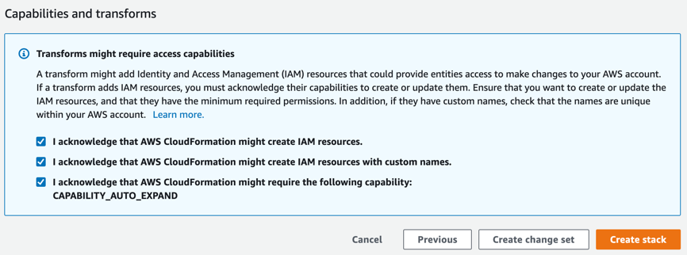
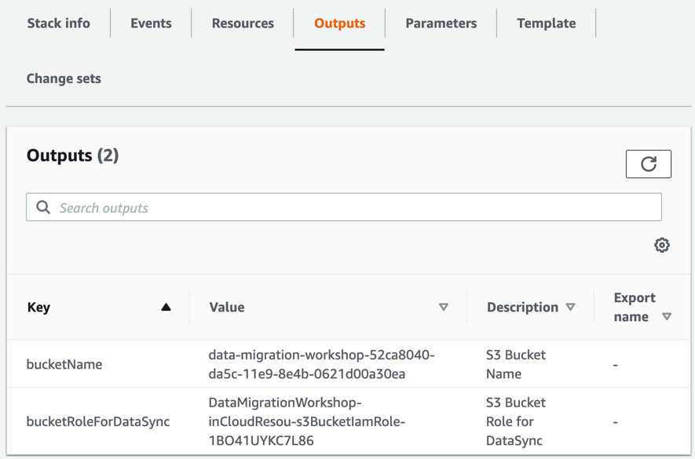
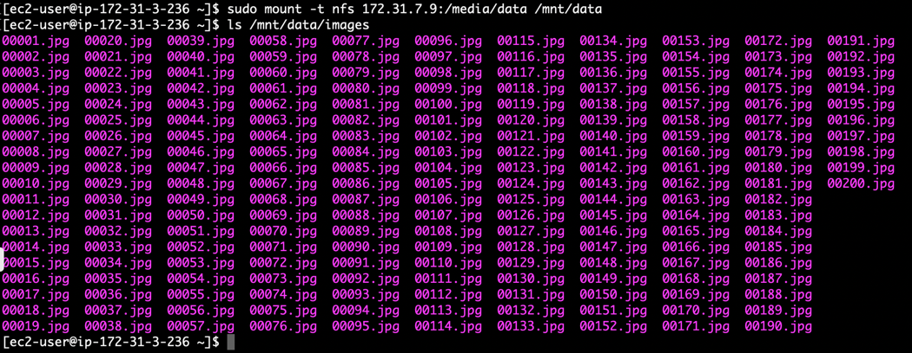
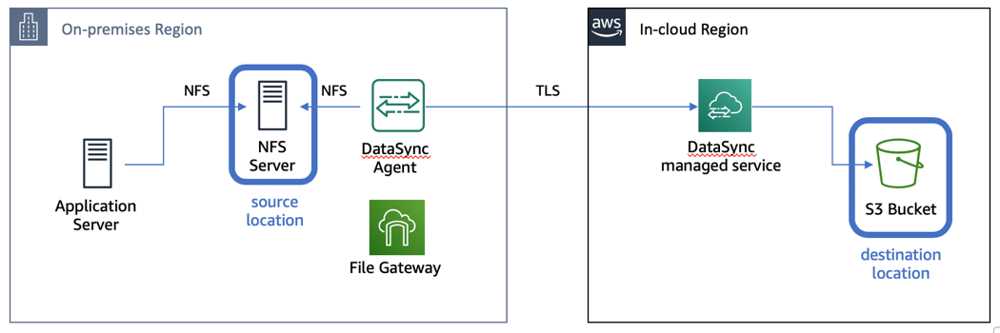
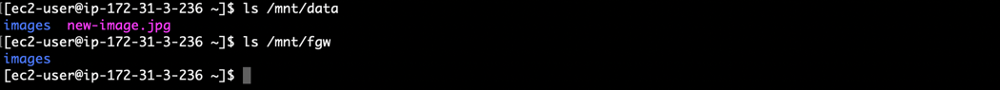
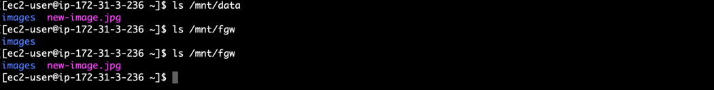
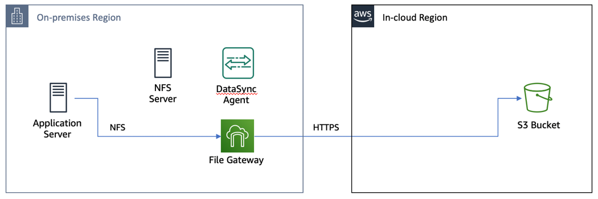

# **AWS DataSync**

### NFS server migration using AWS DataSync and Storage Gateway

© 2019 Amazon Web Services, Inc. and its affiliates. All rights reserved.
This sample code is made available under the MIT-0 license. See the LICENSE file.

Errors or corrections? Contact [jeffbart@amazon.com](mailto:jeffbart@amazon.com).

---

## Workshop scenario

In your data center, you have an NFS server that is starting to age out.  Most of the data on the server is several years old and is only accessed for reading occasionally.  There are new files being written to the server but not very often.  To reduce your data center footprint and to free up resources, you would like to move the data on the NFS server into the cloud.  However, you cannot yet move your application servers that access the NFS data – those need to stay on-premises to minimize latency for your users.

After doing some research, you have realized that you can use AWS DataSync to migrate the data from your on-premises NFS server to Amazon S3, and you can use AWS Storage Gateway to provide NFS access on-premises to the data once it is in S3.

This workshop will walk you through this scenario, using CloudFormation templates to deploy resources and the AWS Management console to configure those resources accordingly.  As shown in the architecture diagram below, an NFS server, an Application server, a DataSync agent, and a File Gateway appliance will be deployed in an AWS region simulating the on-premises environment.  An S3 bucket will be created in an AWS region, simulating the AWS cloud region to which the NFS server&#39;s data will be migrated.

## Prerequisites

#### AWS Account

In order to complete this workshop, you will need an AWS account with rights to create AWS IAM roles, EC2 instances, AWS DataSync, AWS Storage Gateway and CloudFormation stacks in the AWS regions you select.

It will cost approximately 3 USD to run this workshop.  It is recommended that you follow the cleanup instructions once you have completed the workshop to remove all deployed resources and limit ongoing costs to your AWS account.

#### Client Software

- **Browser**  – It is recommended that you use the latest version of Chrome or Firefox for this workshop.

- **SSH Client**  - You will need an SSH client (i.e. Putty, etc.) to access EC2 instances.  Use the following links for instructions on how to install an SSH client, per your operating system:
  - [Connect from Windows using PuTTY](https://docs.aws.amazon.com/quickstarts/latest/vmlaunch/step-2-connect-to-instance.html#putty)
  - [Connect from Mac or Linux using an SSH client](https://docs.aws.amazon.com/quickstarts/latest/vmlaunch/step-2-connect-to-instance.html#sshclient)

- **Key Pair**  – You will need a valid EC2 Key Pair in the AWS region you choose for your on-premises region. For more information on generating and downloading an EC2 Key Pair  see [creating a key pair using Amazon EC2](http://docs.aws.amazon.com/AWSEC2/latest/UserGuide/ec2-key-pairs.html#having-ec2-create-your-key-pair).

## Workshop Modules

This workshop consists of five modules:

- **Module 1**  - Deploy resources in the on-premises and in-cloud regions
- **Module 2** - Initial file copy to S3 using DataSync
- **Module 3**  - Access S3 bucket on-premises using File Gateway
- **Module 4**  - One last incremental copy before cutover
- **Module 5** - Cutover to File Gateway and shutdown the NFS server

# Module 1
## Deploy resources in the on-premises and in-cloud regions

## Introduction

In this module, you will use CloudFormation scripts to deploy resources in two AWS regions: one that represents the on-premises environment, and one for the in-cloud environment.  Once all resources have been deployed, you will mount an export from the NFS server on the Application server and verify existing files.

## Module Steps

#### 1. Deploy AWS resources for the on-premises region

1. Click one of the launch links in the table below to deploy the **on-premises** resources using CloudFormation.  To avoid errors during deployment, select a region in which you have previously created AWS resources.

  | **Region Code** | **Region Name** | **Launch** |
  | --- | --- | --- |
  | us-west-1 | US West (N. California) | [Launch in us-west-1](https://console.aws.amazon.com/cloudformation/home?region=us-west-1#/stacks/new?stackName=DataMigrationWorkshop-onPremResources&amp;templateURL=https://aws-datasync-samples.s3-us-west-2.amazonaws.com/workshops/nfs-migration/data-migration-workshop-on-prem.yaml) |
  | us-west-2 | US West (Oregon) | [Launch in us-west-2](https://console.aws.amazon.com/cloudformation/home?region=us-west-2#/stacks/new?stackName=DataMigrationWorkshop-onPremResources&amp;templateURL=https://aws-datasync-samples.s3-us-west-2.amazonaws.com/workshops/nfs-migration/data-migration-workshop-on-prem.yaml) |
  | us-east-1 | US East (N. Virginia) | [Launch in us-east-1](https://console.aws.amazon.com/cloudformation/home?region=us-east-1#/stacks/new?stackName=DataMigrationWorkshop-onPremResources&amp;templateURL=https://aws-datasync-samples.s3-us-west-2.amazonaws.com/workshops/nfs-migration/data-migration-workshop-on-prem.yaml) |
  | us-east-2 | US East (Ohio) | [Launch in us-east-2](https://console.aws.amazon.com/cloudformation/home?region=us-east-2#/stacks/new?stackName=DataMigrationWorkshop-onPremResources&amp;templateURL=https://aws-datasync-samples.s3-us-west-2.amazonaws.com/workshops/nfs-migration/data-migration-workshop-on-prem.yaml) |

2. Click  **Next**  on the Create Stack page.
3. In the **Parameters** section, select your Access Key Pair for this region.  If no key pair is listed, then you will need to create one.  See [Creating a key pair using amazon EC2](http://docs.aws.amazon.com/AWSEC2/latest/UserGuide/ec2-key-pairs.html#having-ec2-create-your-key-pair).
4. Click  **Next**.
5. Click  **Next**  Again. (skipping the Options and Advanced options sections)
6. On the Review page, scroll to the bottom and check the boxes to acknowledge that CloudFormation will create IAM resources, then click  **Create stack**.

  

**Note:** Instances that are launched as part of this CloudFormation template may be in the initializing state for few minutes.

While the CloudFormation deployment progresses in the on-premises region, you can proceed to deploy resources for the in-cloud region.

#### 2. Deploy AWS resources for the in-cloud region

1. Click one of the launch links in the table below to deploy the **in-cloud** resources using CloudFormation.  Use a different region from the on-premises region.  To avoid errors in deployment, select a region in which you have previously created AWS resources.

  | **Region Code** | **Region Name** | **Launch** |
  | --- | --- | --- |
  | us-west-1 | US West (N. California) | [Launch in us-west-1](https://console.aws.amazon.com/cloudformation/home?region=us-west-1#/stacks/new?stackName=DataMigrationWorkshop-inCloudResources&amp;templateURL=https://aws-datasync-samples.s3-us-west-2.amazonaws.com/workshops/nfs-migration/data-migration-workshop-in-cloud.yaml) |
  | us-west-2 | US West (Oregon) | [Launch in us-west-2](https://console.aws.amazon.com/cloudformation/home?region=us-west-2#/stacks/new?stackName=DataMigrationWorkshop-inCloudResources&amp;templateURL=https://aws-datasync-samples.s3-us-west-2.amazonaws.com/workshops/nfs-migration/data-migration-workshop-in-cloud.yaml) |
  | us-east-1 | US East (N. Virginia) | [Launch in us-east-1](https://console.aws.amazon.com/cloudformation/home?region=us-east-1#/stacks/new?stackName=DataMigrationWorkshop-inCloudResources&amp;templateURL=https://aws-datasync-samples.s3-us-west-2.amazonaws.com/workshops/nfs-migration/data-migration-workshop-in-cloud.yaml) |
  | us-east-2 | US East (Ohio) | [Launch in us-east-2](https://console.aws.amazon.com/cloudformation/home?region=us-east-2#/stacks/new?stackName=DataMigrationWorkshop-inCloudResources&amp;templateURL=https://aws-datasync-samples.s3-us-west-2.amazonaws.com/workshops/nfs-migration/data-migration-workshop-in-cloud.yaml) |

2. Click  **Next**  on the Create stack page.
3. Click **Next** (there are no stack parameters) **.**
4. Click  **Next**  again. (skipping the Options and Advanced options sections)
5. On the Review page, scroll to the bottom and check the box to acknowledge that CloudFormation will create IAM resources, then click  **Create stack**.

Wait for the CloudFormation stacks in each region to reach the CREATE\_COMPLETE state before proceeding to the next steps.  It should take about 3 to 5 minutes for both CloudFormation stacks to complete.

#### 3. Stack Outputs

Upon completion, each CloudFormation stack will have a list of &quot;Outputs&quot;.  These are values such as IP addresses and resource names that will be used throughout the workshop.  You can either copy these values elsewhere or keep the page open in your browser and refer to them as you go through the workshop.

On the CloudFormation page in the **on-premises** region, click on the **Outputs** tab, as shown in the image below.  You should see four values listed:

- **appServerPrivateIP** – This is the private IP address of the Application Server.  You will use this when creating the File Gateway file share to limit access to the NFS export.
- **dataSyncAgentPublicIP** – This is the public IP address of the EC2 instance running the DataSync agent.  You will use this when activating the DataSync agent.
- **fileGatewayPublicIP** – This is the public IP address of the EC2 instance running the File Gateway.  You will use this when activating the File Gateway.
- **nfsServerPrivateIP** – This is the private IP address of the NFS server.  You will use this both on the Application Server and when creating a location for DataSync.

  

On the CloudFormation page in the **in-cloud** region, click on the **Outputs** tab as shown in the image below.  You should see two values listed:

- **bucketName** – This is the name of the S3 bucket where the data will be copied to.  You will use this when creating a file share on the File Gateway.
- **bucketRoleForDataSync** – This is the role that will be used by the DataSync agent to write files to the S3 bucket.  You will use this when creating the S3 location for DataSync.

  

#### 4. Connect to the Application server via SSH

1. From the AWS console in the **on-premises** region, click  **Services**  and select  **EC2.**

2. Select  **Instances**  from the menu on the left.
3. Wait until the state of the four new instances (ApplicationServer, FileGateway, NfsServer, and DataSyncAgent) shows as _running_ and all Status Checks have completed (i.e. **not** in _Initializing_ state).
4. Right-click on the **ApplicationServer** instance and select  **C**** onnect** from the menu.
5. From the dialog box, select and copy the SSH command highlighted below.

  

6. If using a CLI for SSH, paste the selected text into your SSH client, specifying the correct path to your Access Key Pair _.pem_ file.  If prompted to add this IP address to a list of known hosts, enter &quot;yes&quot;.

## Validation Step

In the SSH console for the Application server, run the following commands to mount the NFS export and verify the files on the NFS server.  Use the **nfsServerPrivateIP** value from the **on-premises** CloudFormation stack output.

    $ sudo mount -t nfs <nfs-server-ip-address>:/media/data /mnt/data
    $ ls /mnt/data/images

In the /mnt/data/images folder you should see 200 image files, as shown below.  These image files represent the NFS server data that will be migrated to the S3 bucket in the in-cloud region.

## Module Summary

In this module, you deployed all of the resources necessary to complete this workshop in both the on-premises region and the in-cloud region.  You have also mounted the NFS export on the Application server and verified your data set.

In the next module, you will create a DataSync task to do an initial copy of files from the NFS server to the S3 bucket.

# Module 2
## Initial file copy to S3 using DataSync

## Introduction

In this module, you will activate the DataSync agent deployed in the on-premises region, create DataSync locations, and then create a DataSync task to copy data from the source location to the destination location.

DataSync tasks perform the job of copying data and require two &quot;locations&quot; – a source and a destination.  With DataSync, a location is an endpoint where files reside or will be copied to.  A location can be an NFS export, an SMB share, an Amazon S3 bucket, or an Amazon EFS file system.  Location objects are independent of tasks and a single location can be used with multiple tasks.

## Module Steps

#### 1. Activate the DataSync agent

Although the agent instance was created in the previous module, before it can be used it needs to be activated in the **in-cloud** region.  Follow the steps below to active the agent.

1. Go to the AWS Management console page in the **in-cloud** region and click  **Services**  then select  **DataSync.**
2. If no DataSync agents exist, click the **Get started** button, otherwise click the **Create agent** button.
3. Leave the Service endpoint as-is.

4. Under the **Activation key** section, enter the **Public IP address** of the DataSync agent instance running in the on-premises region, per the CloudFormation outputs.  Here you use the Public IP address, as it needs to be accessible by your web browser.  Enter the IP address of the agent as shown below, then click **Get key.**

  

5. Once the activation is successful, you will be shown the activation key and will be prompted for further information.

  

6. Enter an Agent name if desired, then click **Create agent**.

#### 2. Create NFS location

1. On the left-hand side of the page, click on **Locations** and then click on **Create location**.

2. Create a location for the on-premises NFS server.  Select **Network File System (NFS)** from the _Location type_ drop-down.
3. From the _Agents_ drop-down, select the DataSync agent that was created in the previous step.
4. Enter the **Private IP address** of the NFS server, per the CloudFormation outputs in the **on-premises** region.  This was the same IP address used to mount the NFS export on the Application server, in the previous module.  The is the IP address that the DataSync agent will use to mount the NFS export.
5. Under _Mount path_, enter &quot;/media/data&quot;.

  

6. Click **Create location**.

#### 3. Create S3 location

1. On the left-hand side of the page, click on **Locations** and then click on **Create location**.

2. Create a location for the S3 bucket.  Select **Amazon S3 bucket** from the _Location type_ drop-down.
3. From the _S3 bucket_ drop-down, select the S3 bucket that starts with **data-migration-workshop** and is followed by a long GUID.
4. Under _Folder_, enter &quot;/&quot;.  This will copy all files to the top-level of the bucket.
5. Under _IAM role_, select the bucket role that starts with **DataMigrationWorkshop**.  The full name of the role can be found in the outputs for the in-cloud CloudFormation stack.

  

6. Click **Create location**.

On the left-side of the page, click **Locations** again.  You should now have two locations listed.  One for the NFS server and one for the S3 bucket.

#### 4. Create a task

1. On the left-hand side of the page, click on **Tasks** and then click on **Create task**.

2. Under _Source location options_, select **Choose an existing location**.
3. Under the _Existing locations_ drop-down, select the NFS server location you created previously.
4. Click **Next.**

  

5. Under _Destination location options_, select **Choose an existing location**.
6. Under the _Existing locations_ drop-down, select the S3 bucket location you created previously.
7. Click **Next.**
8. Keep all options as-is and then click **Next.**
9. Click **Create task.**

#### 5. Run the task

1. Wait for the **Task status** to report &quot;Available&quot; (you may need to refresh the page).

  

2. To run the task, click the **Start** button, verify the settings, and then click **Start**.
3. The task will immediately go into the &quot;Running&quot; state.
4. Scroll to the bottom of the page, under the **History** section and click on the task execution object listed.

  

5. As the task runs, the execution status will progress from &quot;Launching&quot; to &quot;Preparing&quot; to &quot;Transferring&quot; to &quot;Verifying&quot; and finally to &quot;Success&quot;.  The task execution will report statistics on the job, as shown below.  It will take a few minutes for the task to complete.  Once the task has finished, notice that 202 files were transferred.  This is the 200 files in the data set along with the two folders in the path that we specified.

  

## Validation Step

From the in-cloud region management console, select **Services** then **S3.**  In the bucket list, click on the **data-migration-workshop** bucket.  You should see a top-level folder named &quot;images&quot;. Inside this folder should be the 200 .jpg files from the NFS server.

## Module Summary

In this module you successfully activated the DataSync agent and created a task to copy files from the on-premises NFS server into the S3 bucket.  You then verified that the files were copied successfully.

In the next module, you will configure the on-premises File Gateway to connect to the S3 bucket, providing access to the in-cloud files via NFS.

# Module 3
## Access S3 bucket on-premises using File Gateway

## Introduction

You now have the files from the NFS server copied to your S3 bucket.  In this module, you will configure the File Gateway in the on-premises region to connect to your S3 bucket and provide access to the files in the bucket through an NFS share.  You will mount the File Gateway share on the Application server to validate access to the files.

## Module Steps

#### 1. Active the File Gateway

Just as you activated the DataSync agent in the previous module, you need to perform a similar step for the File Gateway, activating it in the **in-cloud** region.  Follow the steps below to activate the gateway.

1. Go to the AWS Management console page in the **in-cloud** region and click  **Services**  then select  **Storage Gateway.**

2. If no gateways exist, click the **Get started** button, otherwise click the **Create gateway** button.
3. Select the **File gateway** type and click **Next.**
4. Select **Amazon EC2** as the host platform, then click **Next**.
5. Select the **Public** endpoint type, then click **Next**.
6. Enter the **Public IP address** of the File Gateway instance that was created in the first module using CloudFormation.  Click **Connect to gateway**.
7. Name the gateway &quot;DataMigrationGateway&quot; then click **Activate gateway**.
8. The gateway will be activated and then it will spend a minute or so preparing the local disk devices.  Allocate the **300 GB /dev/sdc** device to **Cache.**  This is the local disk that will be used to cache frequently accessed files.
9. Click **Configure logging.**
10. Leave the setting at _Disable Logging_ then click **Save and continue.**
11. From the main Storage Gateway page, you will see your gateway listed.

  

#### 2. Create an NFS share

1. Click on the **Create file share** button
2. For the **Amazon S3 bucket name** , enter the name of the S3 bucket that DataSync copied the files to.  You can find the bucket name in the outputs of the CloudFormation stack in the **in-cloud** region.
3. Select **NFS** as the access method and make sure your gateway from the previous step is selected.
4. Click **Next**.
5. Keep the default settings, then click **Next**
6. Under the **Allowed clients** section, click **Edit** and change &quot;0.0.0.0/0&quot; to the **Private IP Address** of the Application server.  This will only allow the Application server to access the NFS file share.  Click the **Close** button.
7. Under the **Mount options** section, change the **Squash level** to &quot;No root squash&quot;.  Click the **Close** button.
8. Click **Create file share**.
9. Select the check box next to the new file share and note the mount instructions.

  

10. Copy the **Linux** mount command

#### 3. Mount the NFS share on the Application server

1. Return to the SSH console for the Application server and run the following command to create a new mount point for the File Gateway share:

        $ sudo mkdir /mnt/fgw

1. Paste the Linux mount command from the previous step and replace &quot;[MountPath]&quot; with &quot;/mnt/fgw&quot;.   **You must run the command as sudo.**
2. You should now have two NFS mount points on your Application server: one for the on-premises NFS server (mounted at /mnt/data) and one for the File Gateway (mounted at /mnt/fgw).

  

## Validation Step

Run the following command to verify that the same set of files exist on both NFS shares.

    $ diff -qr /mnt/data /mnt/fgw

You should see only one extra file in /mnt/fgw: .aws-datasync-metadata.  This file was created by DataSync in the S3 bucket when the task was executed.  All other files are the same, indicating that our data was fully transferred by DataSync without errors.

## Module Summary

In this module you successfully activated the File Gateway and created an NFS file share on the gateway.  You then mounted the share on the Application server and verified that the files from the on-premises NFS server were copied correctly to the S3 bucket.

Remember that our ultimate goal in this workshop is to shut off the on-premises NFS server and free up storage resources.  In a production environment, this would typically involve a &quot;cutover point&quot;, where there is momentary downtime as the Application server changes over to the new storage, which in this workshop is the File Gateway NFS share.  However, there are usually new files being created while a migration occurs, or shortly after, requiring another incremental file copy before cutover.

In the next module, you&#39;ll do one more incremental copy before the final cutover to the File Gateway share.

# Module 4
## One last incremental copy before cutover

## Introduction

In this module, you will perform an incremental data transfer using DataSync.  This will get any new files that may have been created after the initial data copy.  Once you have verified all files from the on-premises NFS server have been copied, you can proceed to cutover.

## Module Steps

#### 1. Create a new file on the NFS server

1. From the SSH console for the Application server, run the following command to create a new file on the NFS server:

        $ sudo cp /mnt/data/images/00001.jpg /mnt/data/new-image.jpg

#### 2. Copy the new file to the S3 bucket

You have already created a DataSync task to copy files from the NFS server to the S3 bucket.  To copy the new file, you will just re-run the task.  DataSync will only copy files that have changed between the source and the destination.

1. Return to the in-cloud region AWS management console and go to the **DataSync** service.
2. Select the task created previously and click the **Start** button.
3. Use the default settings and then click **Start**.
4. Scroll to the bottom of the page and select the newest task execution from the list.

  

It will take a few minutes for the task to complete.  When the task completes, take a look at the stats.  Although you ran the exact same task as last time, only 2 files were copied (the new file and the changes on the folder that contains the new file).

If you take a look at the S3 bucket, you see that the new file is there, just as expected:

## Validation Step

With the new file in the S3 bucket, you should be able to see it through the File Gateway share on the Application server, right?  Let&#39;s take a look:

Hmm.  You copied the file from the NFS server to S3 using DataSync.  And the File Gateway is connected to the S3 bucket.  So what&#39;s going on?  Why can&#39;t you see the file on the File Gateway share on the Application server?

In this case, the file was written to the S3 bucket via DataSync, **not** through the File Gateway share itself.  File Gateway is not aware that there are new objects in the bucket.  In order to see the new file on the Application server, you need to refresh the metadata cache on the File Gateway.

Go to the in-cloud region management console and go to the **Storage Gateway** service.  On the left side of the page, click on **File shares** and select the NFS share from the list.  Click on the **Actions** button and select **Refresh cache** then click **Start**. In this case, you have a bucket with only a few hundred objects, so the refresh will be quick.  Note that on large buckets with many objects, a cache refresh can take quite a bit of time.  To reduce the scope of the refresh, you can use the API or CLI and limit the refresh to a specific directory.  You can also use CloudWatch events to monitor when a cache refresh completes.

Head back to the SSH console for the Application server and repeat the &quot;ls /mnt/fgw&quot; command.  You should now see the new file.

## Module Summary

In this module you added a new file to the NFS server prior to cutover.  You then ran the DataSync task a second time to pick up any file changes and copy them to S3.  Finally, you used the Refresh Cache method to update the metadata on the File Gateway to see the new files in S3.

With all of the data copied from the NFS server to S3, you are now ready to perform the cutover.

# Module 5
## Cutover to File Gateway and shutdown the NFS server

## Introduction

With all of the data in the S3 bucket, you are now ready to shut down your NFS server and move exclusively to using the File Gateway.  In this module, you will unmount the NFS server and clean up your DataSync resources.  You will then write some test files through File Gateway, verifying they end up in the S3 bucket.

## Module Steps

#### 1. Unmount the NFS server

1. From the SSH console for the Application server, run the following command to unmount the NFS server:

        $ sudo umount /mnt/data

#### 2. Clean up DataSync resources

You&#39;re done with DataSync so you can go ahead and clean up resources.

1. Go to the **in-cloud** region AWS management console and go to the **DataSync** service.

2. Select **Tasks** and delete the task you created previously
3. Select **Locations** and delete the locations you created previously
4. Select **Agents** and delete the agent you activated previously.  Note that this **will not** delete the actual DataSync agent EC2 instance.  That will get deleted later, when the CloudFormation stack is deleted.

## Validation Step

From the Application server SSH console, run the following command to create another new file in the S3 bucket through the File Gateway:

    sudo cp /mnt/fgw/images/00002.jpg /mnt/fgw/new-image2.jpg

Go back to the in-cloud region management console and go to **S3**.  Select the **data-migration-workshop** bucket.  You should see the new-image2.jpg file in the bucket.

Your Application server has completed cutover!  You can now read all of the files that used to be on the NFS server using the File Gateway share.  And any new files written to the share will automatically be uploaded to the S3 bucket.  You can now shutdown and decommission your NFS server!

One of the benefits of using File Gateway is that it stores files as complete, wholly accessible objects in S3.  With your data is in S3, you can now use services such as Amazon Athena, Amazon SageMaker, Amazon EMR, and many other AWS services to gain even greater value and insight from your data.

## Workshop Cleanup

To make sure all resources are deleted after this workshop scenario make sure you execute the steps in the order outlined below (you do not need to wait for CloudFormation to finish deleting before moving to the next step):

1. Unmount the File Gateway NFS share on the Application server by running the following command:

        sudo umount /mnt/fgw

2. Delete the File Gateway **NFS file share** in the in-cloud region
3. Delete the File Gateway in the in-cloud region named **DataMigrationGateway**.  Note this will not delete the gateway EC2 instance.  The instance will get deleted when the CloudFormation in the on-premises region is deleted.
4. Delete all objects in the **data-migration-workshop** S3 bucket in the in-cloud region.  The bucket must be empty before it can be deleted by CloudFormation in the next step.

5. Go to the CloudFormation page in the in-cloud region and delete the stack named &quot;DataMigrationWorkshop-inCloudResources&quot;
6. Go to the CloudFormation page in the on-premises region and delete the stack named &quot;DataMigrationWorkshop-onPremResources&quot;

To make sure that all CloudFormation templates have been deleted correctly, confirm that all EC2 instances created in this workshop in the on-premises region are in the **terminated** state.
