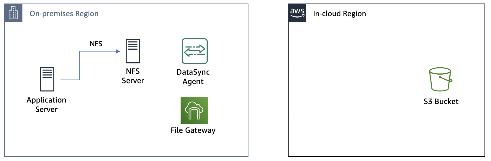
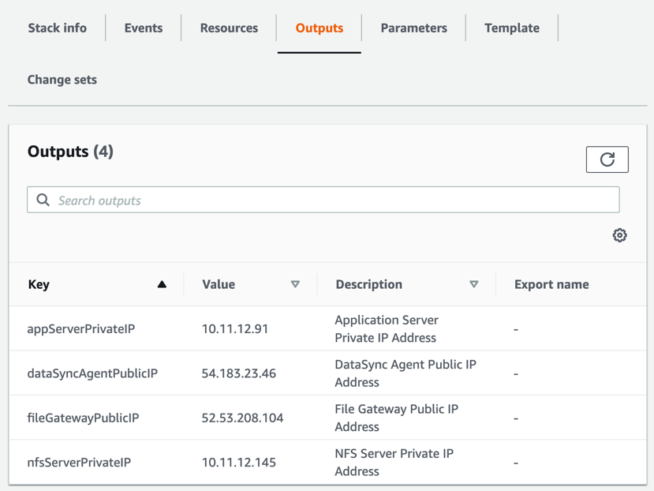
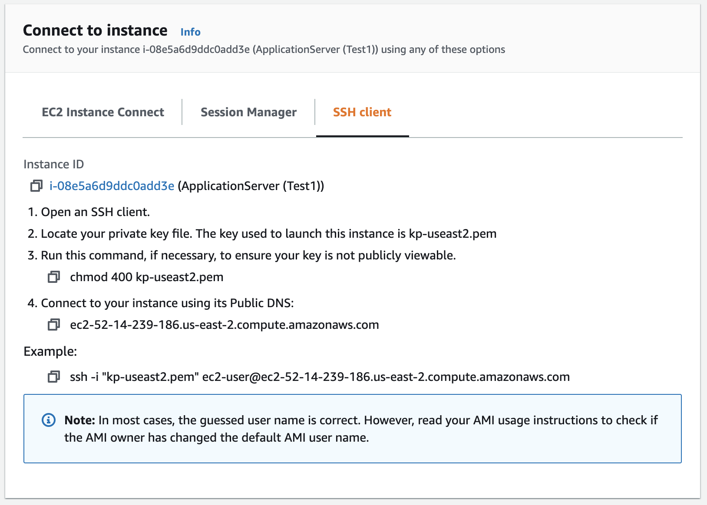
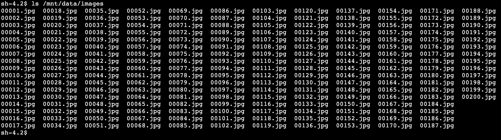

# **AWS DataSync**

### AWS DataSyncとAWS Storage Gatewayを使ったNFSサーバーマイグレーション

© 2019 Amazon Web Services, Inc. and its affiliates. All rights reserved.
This sample code is made available under the MIT-0 license. See the LICENSE file.

Errors or corrections? Contact [jeffbart@amazon.com](mailto:jeffbart@amazon.com).

---

# モジュール 1
## オンプレミスとin-cloudリージョンへのリソースのデプロイ

このモジュールでは、２つのAWSリージョンにリソースをデプロイするためにクラウドフォーメーションスクリプトを使用します。１つはオンプレミス環境を擬似したリージョン、もう１つはin-cloudリージョンです。全てのリソースのデプロイが完了すると、アプリケーションサーバーからNFSのExportをマウントし、その中のファイルを確認する事が出来ます。

## このモジュールの手順

#### 1. オンプレミスリージョンへのリソースのデプロイ

1. クラウドフォーメーションを使用して**on-premises**リソースをデプロイするために、以下の中からリンクを選択し、クリックして下さい。 デプロイ中のエラーを回避するために、以前にリソースを作成した事の有るリージョンの選択を推奨します。

  | **リージョンコード** | **リージョン名** | **起動リンク** |
  | --- | --- | --- |
  | us-west-1 | US West (N. California) | [us-west-1へデプロイ](https://console.aws.amazon.com/cloudformation/home?region=us-west-1#/stacks/new?stackName=DataMigrationWorkshop-onPremResources&amp;templateURL=https://aws-datasync-samples.s3-us-west-2.amazonaws.com/workshops/nfs-migration/data-migration-workshop-on-prem.yaml) |
  | us-west-2 | US West (Oregon) | [us-west-2へデプロイ](https://console.aws.amazon.com/cloudformation/home?region=us-west-2#/stacks/new?stackName=DataMigrationWorkshop-onPremResources&amp;templateURL=https://aws-datasync-samples.s3-us-west-2.amazonaws.com/workshops/nfs-migration/data-migration-workshop-on-prem.yaml) |
  | us-east-1 | US East (N. Virginia) | [us-east-1へデプロイ](https://console.aws.amazon.com/cloudformation/home?region=us-east-1#/stacks/new?stackName=DataMigrationWorkshop-onPremResources&amp;templateURL=https://aws-datasync-samples.s3-us-west-2.amazonaws.com/workshops/nfs-migration/data-migration-workshop-on-prem.yaml) |
  | us-east-2 | US East (Ohio) | [us-east-2へデプロイ](https://console.aws.amazon.com/cloudformation/home?region=us-east-2#/stacks/new?stackName=DataMigrationWorkshop-onPremResources&amp;templateURL=https://aws-datasync-samples.s3-us-west-2.amazonaws.com/workshops/nfs-migration/data-migration-workshop-on-prem.yaml) |
  | eu-west-1 | Ireland | [eu-west-1へデプロイ](https://console.aws.amazon.com/cloudformation/home?region=eu-west-1#/stacks/new?stackName=DataMigrationWorkshop-onPremResources&amp;templateURL=https://aws-datasync-samples.s3-us-west-2.amazonaws.com/workshops/nfs-migration/data-migration-workshop-on-prem.yaml) |
  | eu-central-1 | Frankfurt | [eu-central-1へデプロイ](https://console.aws.amazon.com/cloudformation/home?region=eu-central-1#/stacks/new?stackName=DataMigrationWorkshop-onPremResources&amp;templateURL=https://aws-datasync-samples.s3-us-west-2.amazonaws.com/workshops/nfs-migration/data-migration-workshop-on-prem.yaml) |

2. Create Stackページで**Next**をクリック。
3. **Next**をクリック (変更する必要の有るスタックパラメータは有りません)。
4. **Next**をクリック。
5. 再度**Next**をクリック(オプションとアドバンストオプションのセクションはスキップ)。
6. レビューページで最下部までスクロールし、クラウドフォーメーションがIAMリソースを作成する事を許可するチェックボックスにチェックを入れ、**Create stack**をクリック。

**注意:** このクラウドフォーメーションテンプレートで起動したインスタンスは数分間initializingステータスになるので、起動までお待ちください。

オンプレミスリージョンへのクラウドフォーメーションのデプロイが進行中の状態でも、次のin-cloudリージョンのリソースのデプロイに進む事が出来ます。

#### 2. in-cloudリージョンへのリソースのデプロイ

1. クラウドフォーメーションを使用して**in-cloud**リソースをデプロイするために、以下の中からリンクを選択し、クリックして下さい。 先程作成したオンプレミスリージョンとは異なるリージョンを選択して下さい。 デプロイ中のエラーを回避するために、以前にリソースを作成した事の有るリージョンの選択を推奨します。

  | **リージョンコード** | **リージョン名** | **起動リンク** |
  | --- | --- | --- |
  | us-west-1 | US West (N. California) | [us-west-1へデプロイ](https://console.aws.amazon.com/cloudformation/home?region=us-west-1#/stacks/new?stackName=DataMigrationWorkshop-inCloudResources&amp;templateURL=https://aws-datasync-samples.s3-us-west-2.amazonaws.com/workshops/nfs-migration/data-migration-workshop-in-cloud.yaml) |
  | us-west-2 | US West (Oregon) | [us-west-2へデプロイ](https://console.aws.amazon.com/cloudformation/home?region=us-west-2#/stacks/new?stackName=DataMigrationWorkshop-inCloudResources&amp;templateURL=https://aws-datasync-samples.s3-us-west-2.amazonaws.com/workshops/nfs-migration/data-migration-workshop-in-cloud.yaml) |
  | us-east-1 | US East (N. Virginia) | [us-east-1へデプロイ](https://console.aws.amazon.com/cloudformation/home?region=us-east-1#/stacks/new?stackName=DataMigrationWorkshop-inCloudResources&amp;templateURL=https://aws-datasync-samples.s3-us-west-2.amazonaws.com/workshops/nfs-migration/data-migration-workshop-in-cloud.yaml) |
  | us-east-2 | US East (Ohio) | [us-east-2へデプロイ](https://console.aws.amazon.com/cloudformation/home?region=us-east-2#/stacks/new?stackName=DataMigrationWorkshop-inCloudResources&amp;templateURL=https://aws-datasync-samples.s3-us-west-2.amazonaws.com/workshops/nfs-migration/data-migration-workshop-in-cloud.yaml) |
  | eu-west-1 | Ireland | [eu-west-1へデプロイ](https://console.aws.amazon.com/cloudformation/home?region=eu-west-1#/stacks/new?stackName=DataMigrationWorkshop-inCloudResources&amp;templateURL=https://aws-datasync-samples.s3-us-west-2.amazonaws.com/workshops/nfs-migration/data-migration-workshop-in-cloud.yaml) |
  | eu-central-1 | Frankfurt | [eu-central-1へデプロイ](https://console.aws.amazon.com/cloudformation/home?region=eu-central-1#/stacks/new?stackName=DataMigrationWorkshop-inCloudResources&amp;templateURL=https://aws-datasync-samples.s3-us-west-2.amazonaws.com/workshops/nfs-migration/data-migration-workshop-in-cloud.yaml) |

2. Create stackページで**Next**をクリック。
3. **Next**をクリック (スタックパラメータは有りません)。
4. 再度**Next**をクリック(オプションとアドバンストオプションのセクションはスキップ)。
5. レビューページで最下部までスクロールし、クラウドフォーメーションがIAMリソースを作成する事を許可するチェックボックスにチェックを入れ、**Create stack**をクリック。

次のステップに進む前にそれぞれのリージョンのクラウドフォーメーションスタックのステータスがCREATE\_COMPLETEになるまでお待ち下さい。 完了まで10分程度かかります。

**注意:** もし特定のアベイラビリティゾーンでEC2インスタンスタイプが対応しておらず、スタックのデプロイに失敗する場合は、もう一度
試す、または別のリージョンでデプロイして下さい。

#### 3. スタックアウトプット

完了後、それぞれのクラウドフォーメーションスタックは実行結果の&quot;アウトプット（出力）&quot;のリストを表示します。IPアドレスやリソース名等のこれらの情報はワークショップを通して使用します。これらの情報をコピーしておくか、このページをブラウザで表示したままワークショップを進めると、スムーズに進行出来ます。

**オンプレミス**リージョンのクラウドフォーメーションページで**アウトプット（出力）**をクリックすると以下のような4つの項目を確認出来ます。

- **appServerPrivateIP** – アプリケーションサーバーのプライベートIPアドレスです。File Gatewayにおいてファイル共有を作成する際、NFS Exportへのアクセスを制限するために使用します。
- **dataSyncAgentPublicIP** – DataSyncエージェントが動作するEC2インスタンスのパブリックIPアドレスです。DataSyncエージェントをアクティベートする時に使用します。
- **fileGatewayPublicIP** – File Gatewayが動作するEC2インスタンスのパブリックIPアドレスです。File Gatewayをアクティベートする時に使用します。
- **nfsServerPrivateIP** – NFSサーバーのプライベートIPアドレスです。アプリケーションサーバーからのマウント及びDataSyncのロケーション作成時に使用します。

  

**in-cloud**リージョンのクラウドフォーメーションページで**アウトプット（出力）**をクリックすると以下のような2つの項目を確認出来ます。

- **bucketName** – データコピー先のS3バケット名です。File Gatewayでファイル共有を作成する時に使用します。
- **bucketRoleForDataSync** – DataSyncエージェントがS3バケットへファイルを書き込む際のIAMロールです。DataSyncでS3ロケーションを作成する時に使用します。

  

#### 4. EC2インスタンスコネクトを使用してアプリケーションサーバーに接続します

1. AWSコンソールから**オンプレミス** リージョンに移動し、**Services**の中から**EC2**をクリックします。
2. 左側のメニューから**インスタンス**をクリックします。
3. 4つの新たなインスタンス(ApplicationServer, FileGateway, NfsServer, and DataSyncAgent)が _running_ になり、全てのステータスチェックが完了するまで待ちます (例 in _Initializing_ ステータスでは**ありません**)。
4. **ApplicationServer**インスタンスを右クリックし、メニューから**Connect**を選択します。
5. ダイアログボックスから以下のようなイメージで**Session Manager**オプションを選択します。

  

6. **Connect**をクリックします。新しいブラウザのタブが開いて、アプリケーションサーバーへのCLIが表示されます。このタブは開いたままにしておいて下さい。ワークショップを通じてアプリケーションサーバーのCLIを使用します。

## 最後に確認

アプリケーションサーバーのCLIで、NFS exportをマウントしてNFSサーバー上のファイルを確認するために、以下のコマンドを実行して下さい。 **オンプレミス**クラウドフォーメーションスタックのアウトプット（出力）に含まれる**nfsServerPrivateIP**の値を使用してて下さい。

    $ sudo mount -t nfs <nfs-server-ip-address>:/media/data /mnt/data
    $ ls /mnt/data/images

以下のように/mnt/data/imagesフォルダーの配下に200個のイメージファイルが確認できるはずです。これらのイメージデータはin-cloudリージョンのS3にマイグレーションするNFSサーバーのデータとして使用します。

## このモジュールのまとめ

このモジュールでは、オンプレミスリージョンとin-cloudリージョンに、このワークショップで必要となる全てのリソースをデプロイしました。また、アプリケーションサーバー上でNFS exportをマウントし、データセットを確認しました。

次のモジュールではNFSサーバーからS3への初回データ同期を行うためのDataSyncタスクを作成します。

[モジュール 2](../module2/)へ
