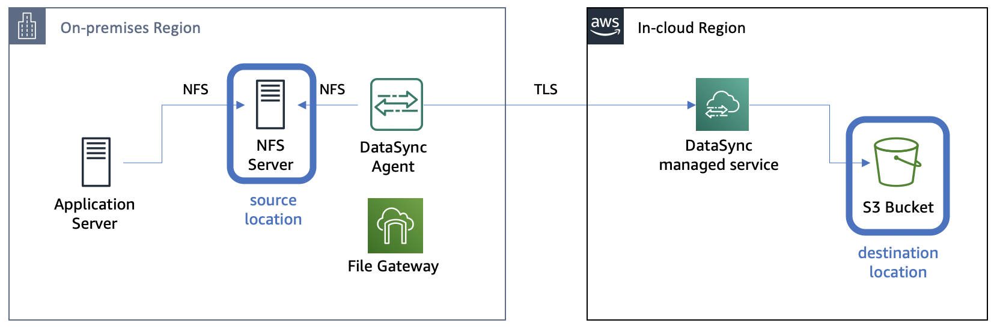
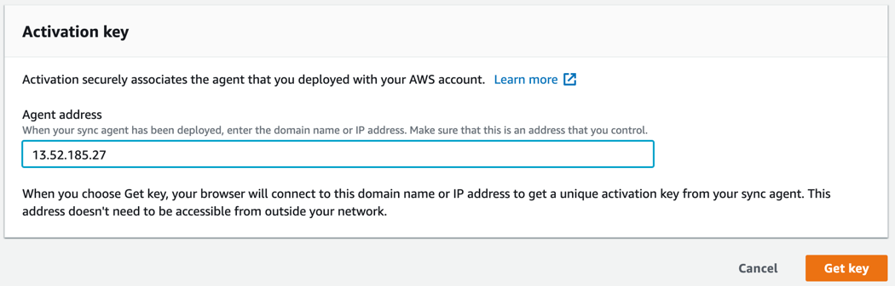
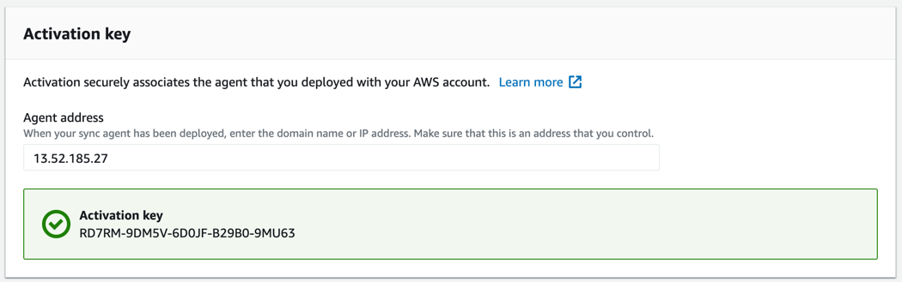
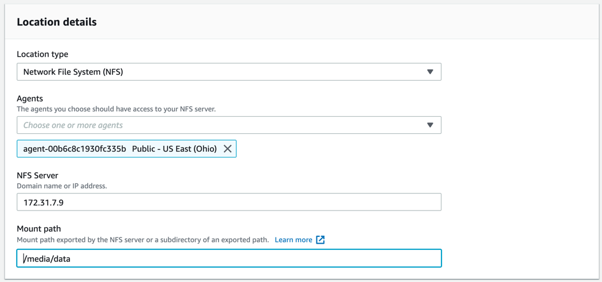
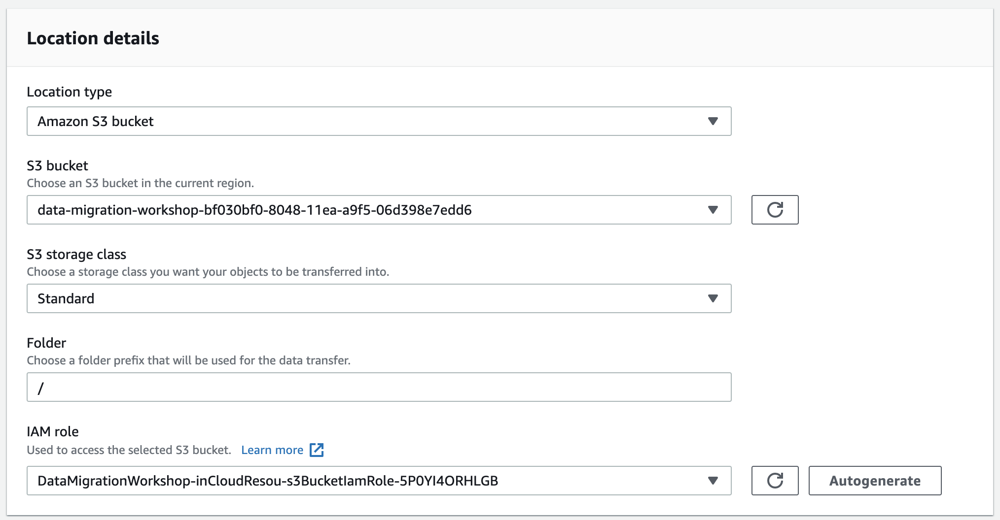
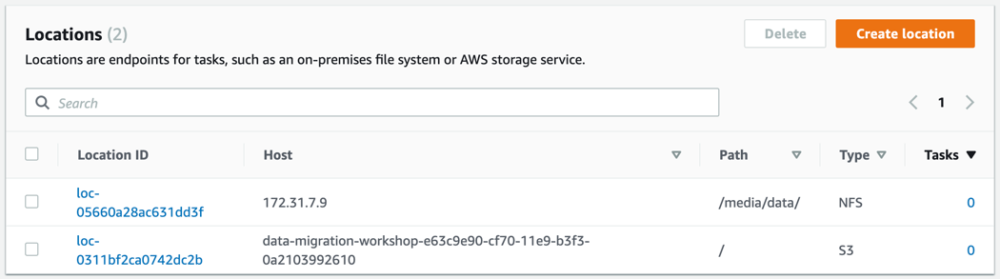
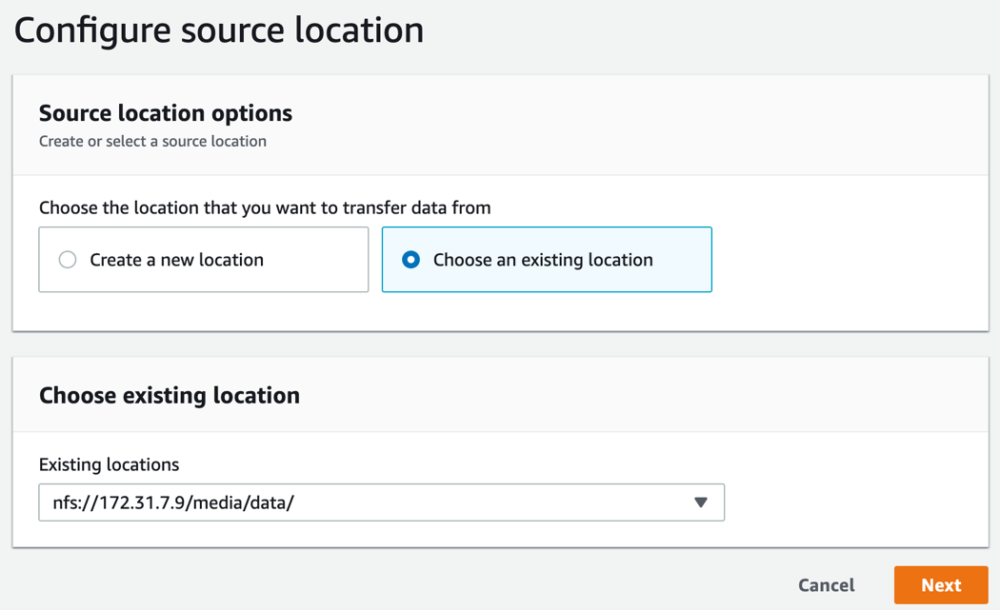
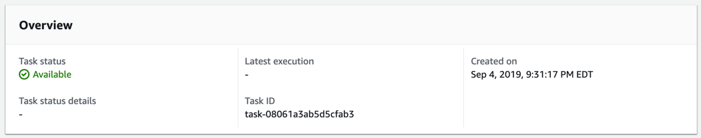
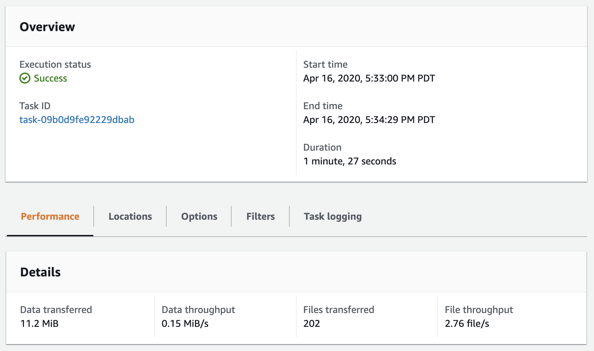
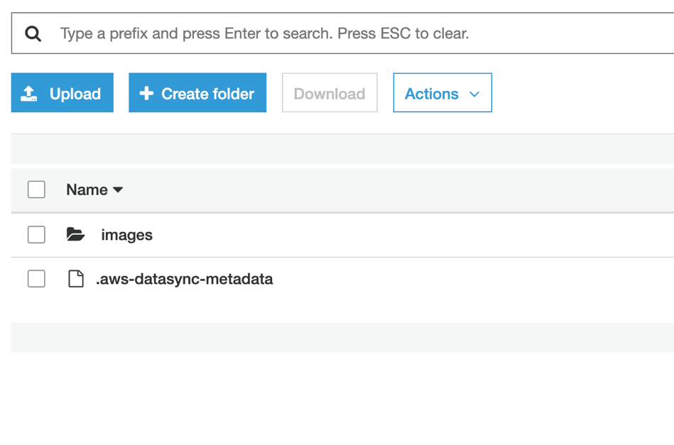

# **AWS DataSync**

### AWS DataSyncとAWS Storage Gatewayを使ったNFSサーバーマイグレーション

© 2019 Amazon Web Services, Inc. and its affiliates. All rights reserved.
This sample code is made available under the MIT-0 license. See the LICENSE file.

Errors or corrections? Contact [jeffbart@amazon.com](mailto:jeffbart@amazon.com).

---

# モジュール 2
## DataSyncを使用したS3への初回ファイル同期

このモジュールでは、オンプレミスリージョンにデプロイしたDataSyncエージェントをアクティベートし、DataSyncロケーションを作成、その後ソースロケーションから宛先ロケーションへデータをコピーするDataSyncタスクを作成します。

DataSyncタスクはデータコピージョブを実行するため、ソースと宛先の2つの &quot;ロケーション&quot;が必要です。DataSyncにおいてロケーションとは、ファイルが置かれている又はコピーの宛先となるエンドポイントです。ロケーションにはNFS export、SMB共有、Amazon S3バケット又はAmazon EFSファイルシステムが含まれます。ロケーションオブジェクトはタスク毎に固有で、1つのロケーションを複数のタスクで使用する事が可能です。

## このモジュールの手順

#### 1. DataSyncエージェントのアクティベート

前のモジュールでエージェント用のインスタンスを作成しましたが、実際に使用出来る状態にするには**in-cloud**リージョンでのアクティベートが必要です。エージェントをアクティベートするには以下の手順に従って下さい。

1. AWSコンソールから**in-cloud** リージョンに移動し、**Services**の中から**DataSync**をクリックします。
2. もしDataSyncエージェントが存在しない場合、**Get started** ボタンをクリックして下さい。その他の場合、**Create agent** ボタンをクリックして下さい。
3. DataSyncエージェントとして動作するEC2インスタンスは既に **オンプレミス** リージョンにデプロイされています。
4. サービスエンドポイントの値は、そのまま**"Public service endpoints"**にして下さい。
5. **Activation key** セクションの中に、オンプレミスリージョンのDataSyncエージェントインスタンスの **Public IP address** を入力して下さい。この値はオンプレミスリージョンのクラウドフォーメーションのアウトプット（出力）から入手出来ます。  アクティベーションのためにブラウザからアクセス出来る必要が有るため、ここではパブリックIPアドレスを使用します。以下のようにエージェントのIPアドレスを入力して、**Get key**をクリックして下さい。

  

6. アクティベーションが成功すると、アクティベーションキーが表示され、その他諸処の情報が表示されます。

  

7. 必要に応じてエージェント名を入力して**Create agent**をクリックして下さい。

#### 2. NFSロケーションの作成

1. DataSyncサービスのページの左側で、**Locations**をクリックし、**Create location**をクリックして下さい。
2. オンプレミスNFSサーバーのロケーションを作成します。Location typeのドロップダウンメニューから**Network File System (NFS)**を選択して下さい。
3. Agentsドロップダウンメニューから前の手順で作成したDataSyncエージェントを選択して下さい。
4. オンプレミスリージョンのクラウドフォーメーションのアウトプット（出力）を参照して、NFSサーバーの**Private IP address**を入力して下さい。これは前のモジュールでアプリケーションサーバーからNFS exportをマウントした時と同じIPアドレスで、DataSyncエージェントがNFS exportをマウントする時に使用します。
5. Mount pathの所には&quot;/media/data&quot;を入力して下さい。

  

6. **Create location**をクリックして下さい。

#### 3. S3ロケーションの作成

1. DataSyncサービスのページの左側で、**Locations**をクリックし、**Create location**をクリックして下さい。
2. S3バケットのロケーションを作成します。Location typeドロップダウンメニューから**Amazon S3 bucket**を選択して下さい。
3. S3 bucketドロップダウンメニューから**data-migration-workshop**で始まるバケット名を選択して下さい。
4. S3ストレージクラスは**Standard**のままにして下さい。
4. Folderの所には&quot;/&quot;を入力して下さい。これにより全てのファイルがバケットのトップレベルにコピーされます。
5. IAM roleの所には**DataMigrationWorkshop-inCloud**で始まるS3バケットIAMロールを選択して下さい。このフルネームはin-cloudリージョンのクラウドフォーメーションのアウトプット（出力）から入手出来ます。 

  

6. **Create location**をクリックして下さい。

ページの左側で再び**Locations**をクリックして下さい。2つのロケーションが表示されます。1つはNFSサーバー、もう1つはS3バケットです。

#### 4. タスクの作成

1. DataSyncサービスのページの左側で、**Tasks**をクリックし、**Create task**をクリックして下さい。
2. Source location optionsの所で**Choose an existing location**を選択して下さい。
3. Existing locationsドロップダウンメニューで、前の手順で作成したNFSサーバーのロケーションを選択して下さい。
4. **Next**をクリックして下さい。

  

5. Destination location optionsの所で**Choose an existing location**を選択して下さい。
6. Existing locationsドロップダウンメニューで、 前の手順で作成したS3バケットのロケーションを選択して下さい。d
7. **Next**をクリックして下さい。
8. **Verify data**ドロップダウンメニューで、**Verify only the data transferred**を選択して下さい。その他のオプションはデフォルトのままで**Next**をクリックして下さい。
9. **Create task**をクリックして下さい。

#### 5. タスクの起動

1. **Task status**が&quot;Available&quot;になるまでお待ち下さい。(ページのリフレッシュが必要な場合が有ります)

  

2. タスクの起動のため、**Start**ボタンをクリックし、設定確認後、**Start**をクリックして下さい。
3. タスクは直ぐに&quot;Running&quot;ステータスへと変わります。
4. **History**タブの所で、実行中のタスクをクリックして下さい。

  

5. タスクが進行すると、ステータスが&quot;Launching&quot;から&quot;Preparing&quot;、&quot;Transferring&quot;、&quot;Verifying&quot;へと変化し、最後に&quot;Success&quot;へと変わります。以下のようにタスクの実行状態が表示されます。タスクが完了するまで数分間かかります。タスクが完了すると、202個のファイルが転送された事が示されます。これは200個のファイルと2つのフォルダの合計です。

  

## 最後に確認

in-cloudリージョンのマネジメントコンソールで、**Services**、**S3**の順に選択します。バケットのリストの中から**data-migration-workshop**バケットをクリックします。&quot;images&quot;という名前のトップレベルフォルダが見えます。 このフォルダの中にはNFSサーバーからコピーされた200個のjpgファイルが存在します。

## このモジュールのまとめ

このモジュールでは、DataSyncエージェントをアクティベートし、オンプレミスのNFSサーバーからS3バケットへファイルをコピーするタスクを作成しました。その後、ファイルがコピーされている事を確認しました。

次のモジュールでは、オンプレミスのFile GatewayをS3につなげるように設定し、NFS経由のクラウドアクセスを提供します。

[モジュール 3](../module3/)へ
