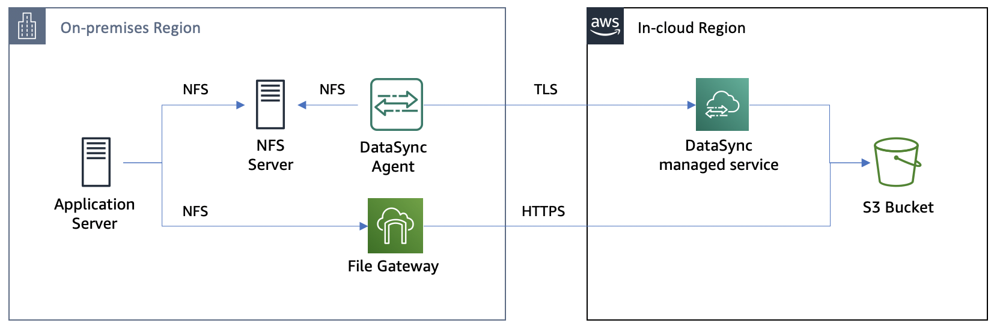

# **AWS DataSync**

### AWS DataSyncとAWS Storage Gatewayを使ったNFSサーバーマイグレーション

© 2019 Amazon Web Services, Inc. and its affiliates. All rights reserved.
This sample code is made available under the MIT-0 license. See the LICENSE file.

Errors or corrections? Contact [jeffbart@amazon.com](mailto:jeffbart@amazon.com).

---

# モジュール 3
## File Gatewayを使用したオンプレミスからのS3バケットへのアクセス

ここまでの手順でDataSyncを使ってNFSサーバーからS3へファイルをコピーしました。このモジュールでは、オンプレミスリージョンのFile GatewayをS3バケットへ接続し、NFS共有を経由してS3バケットのファイルへのアクセスを提供する設定を行います。ファイルへのアクセスを確認するために、アプリケーションサーバーからFile GatewayのNFS共有をマウントします。

## このモジュールの手順

#### 1. File Gatewayのアクティベート

前のモジュールでDataSyncエージェントをアクティベートしたのと同様、File Gatewayを**in-cloud**リージョンでアクティベートする手順を行います。以下の手順に従って下さい。

1. AWSコンソールから**in-cloud** リージョンに移動し、**Services**の中から**Storage Gateway.**をクリックします。
2. もしゲートウェイが存在しない場合、**Get started** ボタンをクリックして下さい。その他の場合、**Create gateway** ボタンをクリックして下さい。
3. **File gateway**タイプを選択し、**Next.**をクリックして下さい。
4. ホストプラットフォームとして**Amazon EC2**を選択し、**Next**をクリックして下さい。
5. **Public**エンドポイントタイプを選択し、**Next**をクリックして下さい。
6. モジュール１のクラウドフォーメーションで作成したFile Gatewayインスタンスの**Public IP address**を入力し、**Connect to gateway**をクリックして下さい。
7. ゲートウェイ名として&quot;DataMigrationGateway&quot;を入力し、**Activate gateway**をクリックして下さい。
8. ゲートウェイがアクティベートされ、その後ローカルディスクデバイスの準備のため、数分時間がかかります。**300 GiB /dev/sdc**デバイスを**Cache.**に割り当てて下さい。これは頻繁にアクセスされるファイルをキャッシュするためのゲートウェイのローカルディスク領域になります。
9. **Configure logging.**をクリックして下さい。
10. _Disable Logging_の設定はそのままにして**Save and continue.**をクリックして下さい。
11. Storage Gatewayのメインページに、作成したゲートウェイが表示されます。

  

#### 2. NFS共有の作成

1. **Create file share**ボタンをクリックして下さい。
2. **Amazon S3 bucket name**の所に、DataSyncのデータコピー先のバケット名を入力して下さい。これはin-cloudリージョンのクラウドフォーメーションのアウトプット（出力）からも取得出来ます。
3. アクセス方式として**NFS**を選択し、前の手順で作成したゲートウェイが選択されている事を確認して下さい。
4. **Next**をクリックして下さい。
5. デフォルト設定のまま**Next**をクリックして下さい。
6. **Allowed clients**セクションで、**Edit**をクリックし、&quot;0.0.0.0/0&quot;からアプリケーションサーバーの**Private IP Address**に変更し、末尾に"/32"を加えて下さい。これにより、アプリケーションサーバーだけがゲートウェイのNFS共有にアクセス出来るようになります。**Close**ボタンををクリックして下さい。
7. **Mount options**セクションで、**Squash level**を&quot;No root squash&quot;に変更して下さい。**Close**ボタンををクリックして下さい。
8. **Create file share**をクリックして下さい。
9. 作成したファイル共有のチェックボックスにチェックを入れ、マウント手順を確認して下さい。

  

#### 3. アプリケーションサーバーからNFS共有をマウント

1. アプリケーションサーバーのCLIに戻り、File Gateway共有へのマウントポイントを作成するために、以下のコマンドを実行して下さい。

        $ sudo mkdir /mnt/fgw

1. Storage Gatewayのファイル共有ページのLinuxコマンドをコピーし、&quot;[MountPath]&quot;部分を&quot;/mnt/fgw&quot;に入れ替えて実行して下さい。   **必ずsudoで実行する必要が有ります。.**
2. これでアプリケーションサーバーに2つのNFSマウントポイントが作成されました。一つはオンプレミスのNFSサーバー（/mnt/dataにマウント）、もう1つはFile Gateway（/mnt/fgwにマウント）です。

  

## 最後に確認

2つのNFS共有に同じファイルが存在する事を確認するため、以下のコマンドを実行して下さい。

    $ diff -qr /mnt/data /mnt/fgw

/mnt/fgwの中に1つだけ追加のファイルが見えます（.aws-datasync-metadata）。このファイルはDataSyncがタスクの完了の際にS3バケットの中に作り出したものです。他の全てのファイルは一致しており、これはDataSyncによってエラーなく転送された事を示します。

## このモジュールのまとめ

このモジュールでは、File Gatewayをアクティベートし、NFSファイル共有をゲートウェイ上に作成しました。その後、アプリケーションサーバーからファイル共有をマウントし、オンプレミスのNFSサーバーと、DataSyncでS3に転送したデータを比較検証しました。

このワークショップの完全なゴールはオンプレミスのNFSサーバーをシャットダウンしてストレージリソースを解放する事である事を思い出して下さい。本番環境では通常、アプリケーションサーバーの接続先が完全にFile Gatewayに切り替わる&quot;カットオーバーポイント&quot;が存在します。しかし実際はマイグレーション後に新たな書き込みが発生し、カットオーバー前にデータの差分が生じます。

次のモジュールでは、File Gatewayへの最後のカットオーバーの前に、もう一度差分データ同期を行います。

[モジュール 4](../module4/)へ
