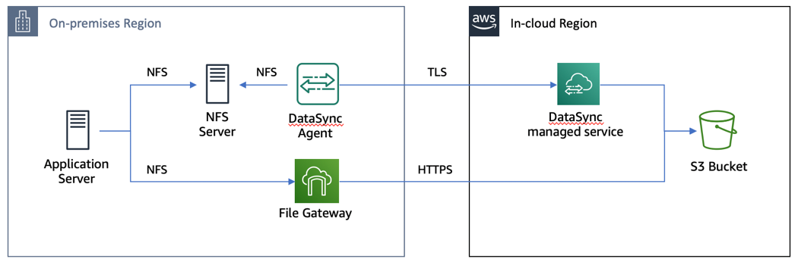
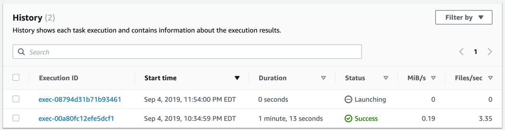
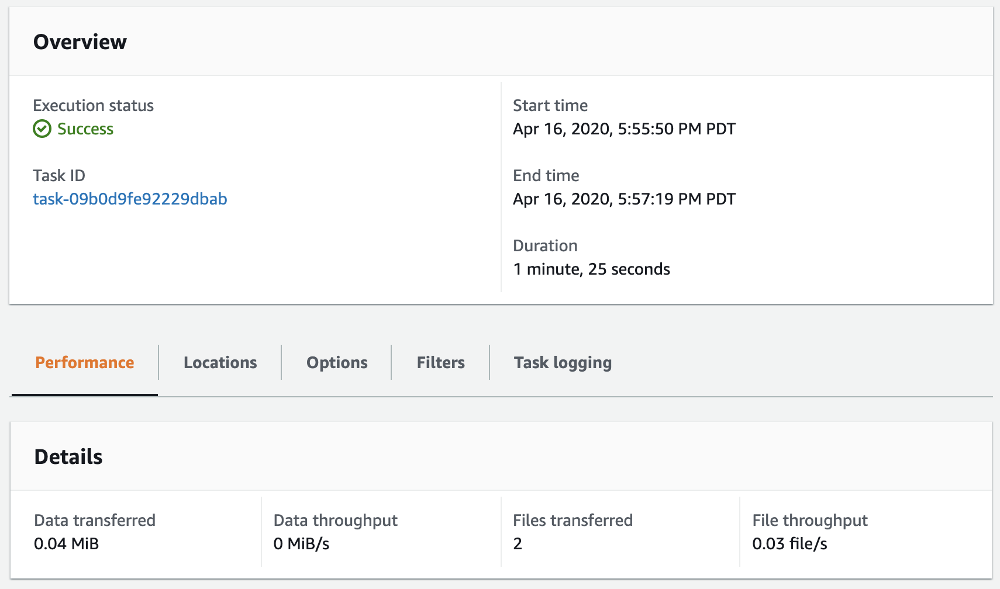
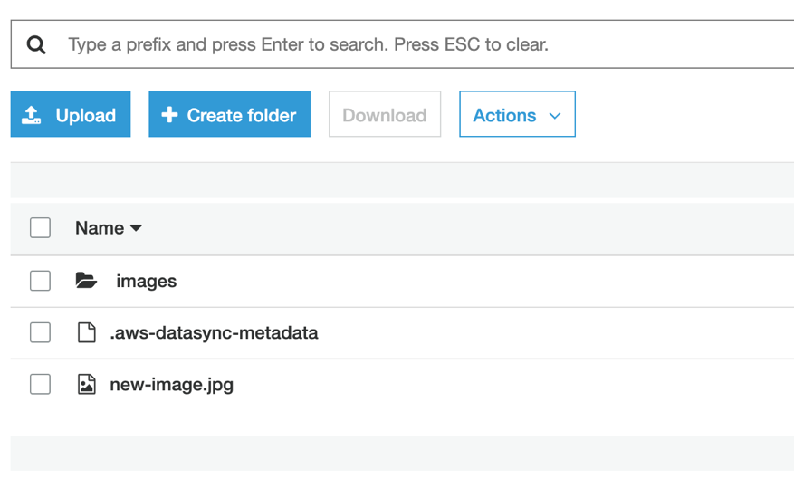
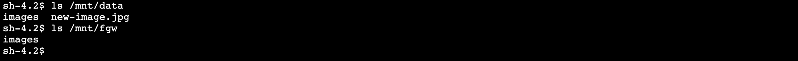

# **AWS DataSync**

### AWS DataSyncとAWS Storage Gatewayを使ったNFSサーバーマイグレーション

© 2019 Amazon Web Services, Inc. and its affiliates. All rights reserved.
This sample code is made available under the MIT-0 license. See the LICENSE file.

Errors or corrections? Contact [jeffbart@amazon.com](mailto:jeffbart@amazon.com).

---

# モジュール 4
## カットオーバー前の最後の差分同期

このモジュールでは、DataSyncを使って差分データのコピーを行います。これにより、初期同期後に作成されたファイルを再同期する事が出来ます。全てのファイルがオンプレミスのNFSサーバーからコピーされた事が確認出来れば、カットオーバーに進む事が出来ます。

## このモジュールの手順

#### 1. NFSサーバーに新しいファイルを作成

1. 新しいファイルをNFSサーバー上に作成するため、アプリケーションサーバーのCLIから以下のコマンドを実行します。

        $ sudo cp /mnt/data/images/00001.jpg /mnt/data/new-image.jpg

#### 2. 新しいファイルをS3バケットへコピー

NFSサーバーからS3バケットへファイルをコピーするDataSyncタスクは既に作成済みです。新しいファイルをコピーするのに必要な事は、単にもう一度タスクを起動するだけです。DataSyncはソースと宛先の間で、変化の有ったファイルだけをコピーします。

1. in-cloudリージョンのAWSマネジメントコンソールに戻り、**DataSync**サービスをクリック。
2. 作成済みのタスクを選択し、**Start**ボタンをクリック。
3. デフォルト設定を使用し、**Start**をクリック。
4. Historyタブ上で、リストの中から最新のタスクの実行を選択

  

タスクの完了まで数分かかります。タスクが完了したら転送済ファイルの数を見て下さい。同じタスクを実行したにも関わらず、2つのファイルしか転送されていません。(新しいファイルそのものと、それを格納しているフォルダーです）

S3バケットの中身を見ると、期待通りファイルが転送されている事が確認出来ます。

## 最後に確認

S3に新しいファイルがコピーされたので、アプリケーションサーバから見ればFile Gateway共有にもファイルが見えるはず？実際に見てみましょう。

んー。。。 確かにDataSyncを使ってNFSサーバーからS3へコピーしたはずです。そしてFile GatewayはS3バケットに繋がっているはずです。何が起きているんでしょう？何故アプリケーションサーバからFile Gateway共有上に新しいファイルが見えないんでしょう。

このケースでは新しいファイルはFile Gateway共有経由**ではなく**DataSync経由でS3へ書き込まれました。File Gatewayはバケットに新しいオブジェクトが有る事を知りません。新しいファイルをアプリケーションサーバーに見せるために、File Gatewayのメタデータキャッシュをリフレッシュする必要が有ります。

in-cloudリージョンのAWSマネジメントコンソールに戻り、**Storage Gateway**サービスをクリック。ページの左側で**File shares**をクリックし、リストからNFS共有を選択。**Actions**ボタンをクリックし、**Refresh cache**を選択。次に**Start**をクリック。

このケースではバケットの中には数百のオブジェクトしか無いため、リフレッシュは直ぐに完了します。多くのオブジェクトを抱えた大きなバケットでは、キャッシュのリフレッシュに時間がかかる可能性が有るので注意して下さい。リフレッシュのスコープを削減してこの問題を改善するために、API又はCLIを使用して、特定のディレクトリだけのリフレッシュをするように制限をかける事が出来ます。CloudWatchイベントで、キャッシュのリフレッシュの完了をモニタする事も出来ます。

アプリケーションサーバーのCLIに戻り、再度&quot;ls /mnt/fgw&quot;コマンドを実行して下さい。新しいファイルを見る事が出来ます。

## このモジュールのまとめ

このモジュールでは、カットオーバー前にNFSサーバーへ新しいファイルを追加しました。次にDataSyncタスクを再度実行し、NFSサーバーとS3間の差分データ転送を行いました。最後にFile Gatewayのメタデータをアップデートするため、キャッシュのリフレッシュを行いました。

NFSサーバーからS3への全てのデータの転送が完了したため、いよいよカットオーバーに進む事が出来ます。

[モジュール 5](../module5/)へ
