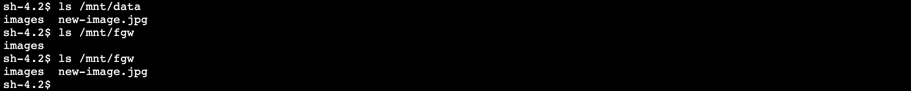

# **AWS DataSync**

### NFS server migration using AWS DataSync and AWS Storage Gateway

© 2019 Amazon Web Services, Inc. and its affiliates. All rights reserved.
This sample code is made available under the MIT-0 license. See the LICENSE file.

Errors or corrections? Contact [jeffbart@amazon.com](mailto:jeffbart@amazon.com).

---

# Module 4
## One last incremental copy before cutover

In this module, you will perform an incremental data transfer using DataSync.  This will get any new files that may have been created after the initial data copy.  Once you have verified all files from the on-premises NFS server have been copied, you can proceed to cutover.

## Module Steps

#### 1. Create a new file on the NFS server

1. From the CLI for the Application server, run the following command to create a new file on the NFS server:

        $ sudo cp /mnt/data/images/00001.jpg /mnt/data/new-image.jpg

#### 2. Copy the new file to the S3 bucket

You have already created a DataSync task to copy files from the NFS server to the S3 bucket.  To copy the new file, you will just re-run the task.  DataSync will only copy files that have changed between the source and the destination.

1. Return to the in-cloud region AWS management console and go to the **DataSync** service.
2. Select the task created previously and click the **Start** button.
3. Use the default settings and then click **Start**.
4. Go to the History tab and select the newest task execution from the list.

  

It will take a few minutes for the task to complete.  When the task completes, take a look at the stats.  Although you ran the exact same task as last time, only 2 files were copied (the new file and the changes on the folder that contains the new file).

If you take a look at the S3 bucket, you see that the new file is there, just as expected:

## Validation Step

With the new file in the S3 bucket, you should be able to see it through the File Gateway share on the Application server, right?  Let&#39;s take a look:

Hmm.  You copied the file from the NFS server to S3 using DataSync.  And the File Gateway is connected to the S3 bucket.  So what&#39;s going on?  Why can&#39;t you see the file on the File Gateway share on the Application server?

In this case, the file was written to the S3 bucket via DataSync, **not** through the File Gateway share itself.  File Gateway is not aware that there are new objects in the bucket.  In order to see the new file on the Application server, you need to refresh the metadata cache on the File Gateway.

Go to the in-cloud region management console and go to the **Storage Gateway** service.  On the left side of the page, click on **File shares** and select the NFS share from the list.  Click on the **Actions** button and select **Refresh cache** then click **Start**.

In this case, you have a bucket with only a few hundred objects, so the refresh will be quick.  Note that on large buckets with many objects, a cache refresh can take quite a bit of time.  To reduce the scope of the refresh, you can use the API or CLI and limit the refresh to a specific directory.  You can also use CloudWatch events to monitor when a cache refresh completes.

Head back to the CLI for the Application server and repeat the &quot;ls /mnt/fgw&quot; command.  You should now see the new file.

## Module Summary

In this module you added a new file to the NFS server prior to cutover.  You then ran the DataSync task a second time to pick up any file changes and copy them to S3.  Finally, you used the Refresh Cache method to update the metadata on the File Gateway to see the new files in S3.

With all of the data copied from the NFS server to S3, you are now ready to perform the cutover.

Go to [Module 5](module5/).
