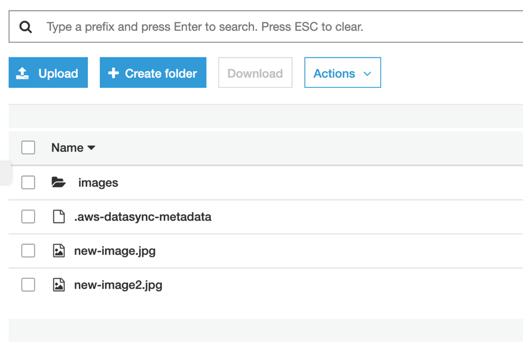

# **AWS DataSync**

### AWS DataSyncとAWS Storage Gatewayを使ったNFSサーバーマイグレーション

© 2019 Amazon Web Services, Inc. and its affiliates. All rights reserved.
This sample code is made available under the MIT-0 license. See the LICENSE file.

Errors or corrections? Contact [jeffbart@amazon.com](mailto:jeffbart@amazon.com).

---

# モジュール 5
## File Gatewayへの完全移行とNFSサーバーのシャットダウン

S3バケットへの全てのデータの転送が完了した事で、オンプレミスのNFSサーバーをシャットダウンし、File Gatewayへと移行する準備が出来ました。このモジュールでは、NFSサーバーをアンマウントし、DataSyncのリソースをクリーンアップします。最後にいくつかのテストファイルをFile Gatewayに書き込み、S3バケットに格納されている事を確認し、カットオーバー完了です。

## このモジュールの手順

#### 1. NFSサーバーをアンマウント

1. アプリケーションサーバーのCLIからNFSサーバーをアンマウントするために以下のコマンドを実行します。

        $ sudo umount /mnt/data

#### 2. DataSyncリソースのクリーンアップ

DataSyncの活用は終わったので、リソースをクリーンアップします。

1. **in-cloud**リージョンのAWSマネジメントコンソールで**DataSync**サービスをクリックして下さい。
2. **Tasks**を選択し、作成済みのタスクを削除して下さい。
3. **Locations**を選択し、 作成済みのロケーションを削除して下さい。
4. **Agents**を選択し、作成済みのエージェントを削除して下さい。これはDataSyncエージェントが動いていたEC2インスタンス自体を削除する訳では**ない**ので注意して下さい。この後のクラウドフォーメーションスタックの削除で削除されます。

## 最後に確認

File Gatewayを通してS3に追加のファイルを作成するため、アプリケーションサーバーのCLIから以下のコマンドを実行して下さい。

    sudo cp /mnt/fgw/images/00002.jpg /mnt/fgw/new-image2.jpg

in-cloudリージョンのマネジメントコンソールに戻り、**S3**をクリックして下さい。そして**data-migration-workshop**バケットを選択して下さい。バケット内にnew-image2.jpgファイルが見えます。

これでアプリケーションサーバーのカットオーバーが完了しました！NFSサーバーに格納していたファイルを全てFile Gateway共有経由で見る事が出来ます。また、共有に書き込まれた全ての新しいファイルは、自動的にS3バケットへアップロードされます。これでNFSサーバーをシャットダウンして撤去する事が出来ます。

File Gatewayを使用するメリットの1つは、完全でアクセス可能なオブジェクトとしてS3に格納出来る事です。S3にデータが有れば、Amazon Athena、Amazon SageMaker、Amazon EMR、その他多くのAWSサービスを活用し、よりデータの価値を活用する事が出来ます。 

## ワークショップクリーンアップ

このワークショップで使用した全てのリソースを削除するために、以下の手順にしたがって実行して下さい。 (次のステップに進むためにクラウドフォーメーションの完了を待つ必要はありません）

1. アプリケーションサーバーのCLIで以下のコマンドを実行し、File Gateway NFS共有をアンマウントして下さい。

        sudo umount /mnt/fgw

2. アプリケーションサーバーCLIのウィンドウを閉じて下さい。
3. in-cloudリージョンのStorage Gatewayのページで**NFS file share**を削除して下さい。
4. in-cloudリージョンの**DataMigrationGateway**という名前のFile Gatewayを削除して下さい。これによりゲートウェイのEC2インスタンスは削除されない点に注意してください。インスタンスの削除はオンプレミスリージョンのクラウドフォーメーションの削除で行われます。
5. in-cloudリージョンの**data-migration-workshop**S3バケット内の全てのオブジェクトを削除してください。次のクラウドフォーメーションによる削除を実行する前に、バケットをからの状態にして置く必要があります。
6. in-cloudリージョンのクラウドフォーメーションのページで、 &quot;DataMigrationWorkshop-inCloudResources&quot;という名前のスタックを削除して下さい。
7. on-premisesリージョンのクラウドフォーメーションのページで、&quot;DataMigrationWorkshop-onPremResources&quot;という名前のスタックを削除して下さい。

全てのクラウドフォーメーションテンプレートが正しく削除された事を確認するために、オンプレミスリージョンの全てのEC2インスタンスが**terminated**ステータスになっている事を確認して下さい。
