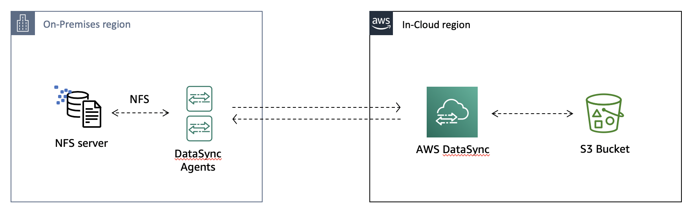

# **AWS DataSync**

### Migrate millions of files using AWS DataSync

© 2020 Amazon Web Services, Inc. and its affiliates. All rights reserved.
This sample code is made available under the MIT-0 license. See the LICENSE file.

Errors or corrections? Contact [jeffbart@amazon.com](mailto:jeffbart@amazon.com).

---

**This workshop is now being maintained in AWS [workshop studio](https://workshops.aws/)**

- [Migrate millions of files using AWS DataSync](https://catalog.us-east-1.prod.workshops.aws/datasync-migrate-millions-of-files/en-US)

---

## Workshop scenario

This is an advanced-level workshop on using [AWS DataSync](https://aws.amazon.com/datasync/)
to transfer millions of files from an on-premises NFS server to Amazon S3.  The workshop
will walk you through practical steps and advanced concepts to consider when transferring large
datasets using AWS DataSync.

In this workshop, you will use CloudFormation templates to deploy resources in two
AWS regions, representing an on-premises environment and an in-cloud region. As shown
in the architecture diagram below, an NFS server and two DataSync agents will be deployed
in the on-premises environment.  An S3 bucket will be created in an AWS region, simulating
the AWS cloud region to which the NFS server&#39;s data will be transferred.

Once the resources have been deployed, you will then use AWS DataSync to transfer
two million files from the NFS server to the S3 bucket.  You will use Amazon CloudWatch
and other tools and services to monitor performance and transfer results.

## Topics covered

- Deploying resources using CloudFormation
- Copying data to Amazon S3 using DataSync
- Performing incremental data transfers with DataSync
- Accessing data stored in an S3 bucket using File Gateway
- Using the Storage Gateway RefreshCache API

## Prerequisites

#### AWS Account

Because this is an advanced-level workshop, it is expected that you are familiar with using the AWS CLI tools and AWS Management console.

In order to complete this workshop, you will need an AWS account with rights to create AWS IAM roles, EC2 instances, AWS DataSync objects, and CloudFormation stacks in the AWS regions you select.

#### Software

- **Internet Browser**  – It is recommended that you use the latest version of Chrome or Firefox
- **AWS CLI** - You should have the latest version of the AWS CLI deployed in your working environment

## Cost

It will cost approximately **15.00 USD** to run this workshop.  It is recommended that you follow the cleanup instructions once you have completed the workshop to remove all deployed resources and limit ongoing costs to your AWS account.

## Related workshops

- [NFS server migration using AWS DataSync and Storage Gateway](https://github.com/aws-samples/aws-datasync-migration-workshop/blob/master/workshops/nfs-migration)
- [Migrate to FSx Windows File Server using AWS DataSync](https://github.com/aws-samples/aws-datasync-fsx-windows-migration)
- [Get hands-on with online data migration options to simplify & accelerate your journey to AWS](https://github.com/aws-samples/aws-online-data-migration-workshop)

## Workshop Modules

This workshop consists of the following modules:

- [Module 1](/workshops/nfs-million-files/module1) - Deploy resources in the on-premises and in-cloud regions
- [Module 2](/workshops/nfs-million-files/module2) - Configure the NFS server
- [Module 3](/workshops/nfs-million-files/module3) - Setup CloudWatch and activate DataSync agents
- [Module 4](/workshops/nfs-million-files/module4) - Run a test transfer to validate network and performance
- [Module 5](/workshops/nfs-million-files/module5) - Run the full transfer
- [Module 6](/workshops/nfs-million-files/module6) - Perform an incremental transfer
- [Module 7](/workshops/nfs-million-files/module7) - Workshop clean-up

To get started, go to [Module 1](/workshops/nfs-million-files/module1).
