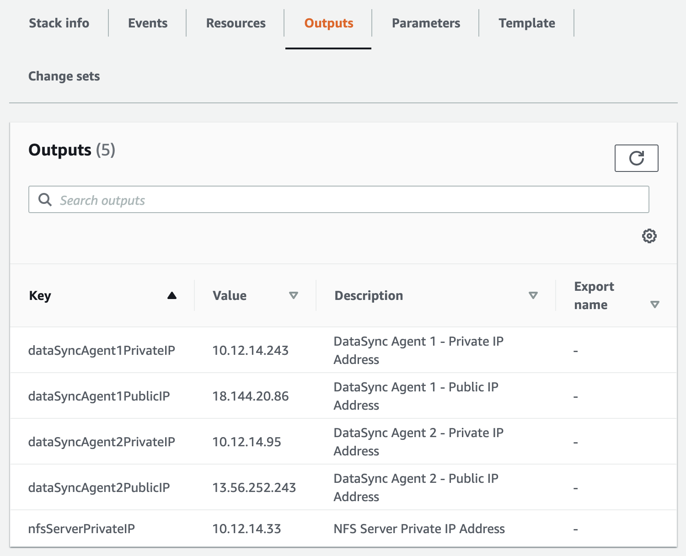

# **AWS DataSync**

### Migrate millions of files using AWS DataSync

© 2020 Amazon Web Services, Inc. and its affiliates. All rights reserved.
This sample code is made available under the MIT-0 license. See the LICENSE file.

Errors or corrections? Contact [jeffbart@amazon.com](mailto:jeffbart@amazon.com).

---

# Module 1
## Deploy resources in the on-premises and in-cloud regions

In this module, you will use CloudFormation scripts to deploy resources in two AWS regions: one that represents your on-premises environment, and one for the in-cloud environment.

## Module Steps

#### 1. Deploy AWS resources for the ON-PREMISES region

1. Click one of the launch links in the table below to deploy the **ON-PREMISES** resources using CloudFormation.  To avoid errors during deployment, select a region in which you have previously created AWS resources.

  | **Region Code** | **Region Name** | **Launch** |
  | --- | --- | --- |
  | us-west-1 | US West (N. California) | [Launch in us-west-1](https://console.aws.amazon.com/cloudformation/home?region=us-west-1#/stacks/new?stackName=MillionFiles-OnPrem&amp;templateURL=https://aws-datasync-samples.s3-us-west-2.amazonaws.com/workshops/nfs-million-files/nfs-million-files-on-prem.yaml) |
  | us-west-2 | US West (Oregon) | [Launch in us-west-2](https://console.aws.amazon.com/cloudformation/home?region=us-west-2#/stacks/new?stackName=MillionFiles-OnPrem&amp;templateURL=https://aws-datasync-samples.s3-us-west-2.amazonaws.com/workshops/nfs-million-files/nfs-million-files-on-prem.yaml) |
  | us-east-1 | US East (N. Virginia) | [Launch in us-east-1](https://console.aws.amazon.com/cloudformation/home?region=us-east-1#/stacks/new?stackName=MillionFiles-OnPrem&amp;templateURL=https://aws-datasync-samples.s3-us-west-2.amazonaws.com/workshops/nfs-million-files/nfs-million-files-on-prem.yaml) |
  | us-east-2 | US East (Ohio) | [Launch in us-east-2](https://console.aws.amazon.com/cloudformation/home?region=us-east-2#/stacks/new?stackName=MillionFiles-OnPrem&amp;templateURL=https://aws-datasync-samples.s3-us-west-2.amazonaws.com/workshops/nfs-million-files/nfs-million-files-on-prem.yaml) |
  | eu-west-1 | Ireland | [Launch in eu-west-1](https://console.aws.amazon.com/cloudformation/home?region=eu-west-1#/stacks/new?stackName=MillionFiles-OnPrem&amp;templateURL=https://aws-datasync-samples.s3-us-west-2.amazonaws.com/workshops/nfs-million-files/nfs-million-files-on-prem.yaml) |
  | eu-central-1 | Frankfurt | [Launch in eu-central-1](https://console.aws.amazon.com/cloudformation/home?region=eu-central-1#/stacks/new?stackName=MillionFiles-OnPrem&amp;templateURL=https://aws-datasync-samples.s3-us-west-2.amazonaws.com/workshops/nfs-million-files/nfs-million-files-on-prem.yaml) |

2. Click **Next**  on the Create Stack page.
3. Under the **Parameters** section, select an EC2 key pair to allow for SSH login to instances created by this stack.  Click **Next**.
5. Click **Next** again (skipping the Options and Advanced options sections).
6. On the Review page, scroll to the bottom and check the boxes to acknowledge that CloudFormation will create IAM resources, then click  **Create stack**.

  

**Note:** Instances that are launched as part of this CloudFormation template may be in the initializing state for a few minutes.

While the CloudFormation deployment progresses in the ON-PREMISES region, you can proceed to deploy resources for the IN-CLOUD region.

#### 2. Deploy AWS resources for the IN-CLOUD region

1. Click one of the launch links in the table below to deploy the **IN-CLOUD** resources using CloudFormation.  Use a different region from the ON-PREMISES region.  To avoid errors in deployment, select a region in which you have previously created AWS resources.

  | **Region Code** | **Region Name** | **Launch** |
  | --- | --- | --- |
  | us-west-1 | US West (N. California) | [Launch in us-west-1](https://console.aws.amazon.com/cloudformation/home?region=us-west-1#/stacks/new?stackName=MillionFiles-InCloud&amp;templateURL=https://aws-datasync-samples.s3-us-west-2.amazonaws.com/workshops/nfs-million-files/nfs-million-files-in-cloud.yaml) |
  | us-west-2 | US West (Oregon) | [Launch in us-west-2](https://console.aws.amazon.com/cloudformation/home?region=us-west-2#/stacks/new?stackName=MillionFiles-InCloud&amp;templateURL=https://aws-datasync-samples.s3-us-west-2.amazonaws.com/workshops/nfs-million-files/nfs-million-files-in-cloud.yaml) |
  | us-east-1 | US East (N. Virginia) | [Launch in us-east-1](https://console.aws.amazon.com/cloudformation/home?region=us-east-1#/stacks/new?stackName=MillionFiles-InCloud&amp;templateURL=https://aws-datasync-samples.s3-us-west-2.amazonaws.com/workshops/nfs-million-files/nfs-million-files-in-cloud.yaml) |
  | us-east-2 | US East (Ohio) | [Launch in us-east-2](https://console.aws.amazon.com/cloudformation/home?region=us-east-2#/stacks/new?stackName=MillionFiles-InCloud&amp;templateURL=https://aws-datasync-samples.s3-us-west-2.amazonaws.com/workshops/nfs-million-files/nfs-million-files-in-cloud.yaml) |
  | eu-west-1 | Ireland | [Launch in eu-west-1](https://console.aws.amazon.com/cloudformation/home?region=eu-west-1#/stacks/new?stackName=MillionFiles-InCloud&amp;templateURL=https://aws-datasync-samples.s3-us-west-2.amazonaws.com/workshops/nfs-million-files/nfs-million-files-in-cloud.yaml) |
  | eu-central-1 | Frankfurt | [Launch in eu-central-1](https://console.aws.amazon.com/cloudformation/home?region=eu-central-1#/stacks/new?stackName=MillionFiles-InCloud&amp;templateURL=https://aws-datasync-samples.s3-us-west-2.amazonaws.com/workshops/nfs-million-files/nfs-million-files-in-cloud.yaml) |

2. Click **Next** on the Create stack page.
3. Click **Next** (there are no stack parameters).
4. Click **Next** again (skipping the Options and Advanced options sections).
5. On the Review page, scroll to the bottom and check the box to acknowledge that CloudFormation will create IAM resources, then click  **Create stack**.

Wait for the CloudFormation stacks in each region to reach the CREATE\_COMPLETE state before proceeding to the next steps.  It should take about 3 to 5 minutes for both CloudFormation stacks to complete.

**NOTE:** If a stack fails to deploy because an EC2 instance type is not available in a particular availability zone, delete the stack and retry in the same region or in a different region.

#### 3. Stack Outputs

Upon completion, each CloudFormation stack will have a list of &quot;Outputs&quot;.  These are values such as IP addresses and resource names that will be used throughout the workshop.  You can either copy these values elsewhere or keep the page open in your browser and refer to them as you go through the workshop.

On the CloudFormation page in the **ON-PREMISES** region, click on the **Outputs** tab, as shown in the image below.  You should see the following values listed:

- **dataSyncAgent1PublicIP** – This is the public IP address of the EC2 instance running the first DataSync agent.  You will use this when activating this particular DataSync agent.
- **dataSyncAgent2PublicIP** – This is the public IP address of the EC2 instance running the second DataSync agent.  You will use this when activating this particular DataSync agent.
- **nfsServerPrivateIP** – This is the private IP address of the NFS server.  You will use this when creating a location for DataSync.

  

On the CloudFormation page in the **IN-CLOUD** region, click on the **Outputs** tab as shown in the image below.  You should see the following values listed:

- **bucketName** – This is the name of the S3 bucket where the data will be copied to.
- **bucketRoleForDataSync** – This is the role that will be used by the DataSync agent to write files to the S3 bucket.  You will use this when creating the S3 location for DataSync.

  

## Module Summary

In this module, you deployed all of the resources necessary to complete this workshop in both the on-premises region and the in-cloud region.

In the next module, you will configure the NFS server and prepare it to be used by DataSync for transferring files to S3.

Go to [Module 2](/workshops/nfs-million-files/module2).
