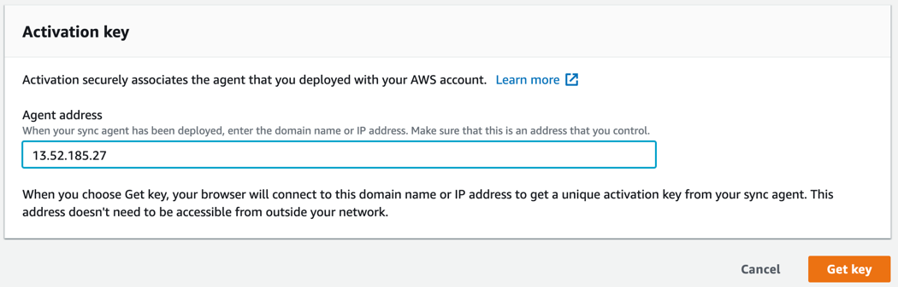
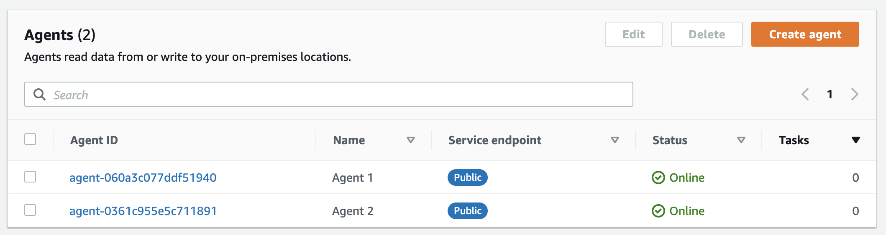

# **AWS DataSync**

### Migrate millions of files using AWS DataSync

© 2020 Amazon Web Services, Inc. and its affiliates. All rights reserved.
This sample code is made available under the MIT-0 license. See the LICENSE file.

Errors or corrections? Contact [jeffbart@amazon.com](mailto:jeffbart@amazon.com).

---

# Module 3
## Configure CloudWatch and activate DataSync agents

With the NFS server configured you can now proceed to setup CloudWatch so it can accept logs from DataSync.  After that, you will activate the DataSync agents in the IN-CLOUD region, in preparation for creating tasks to transfer data.

## Module Steps

#### 1. Configure CloudWatch to allow DataSync logging

When you create a DataSync task, it can be configured to write logs to a CloudWatch log group.  If there are any issues during the transfer then a log entry will be created for each problematic file, allowing you to investigate once the DataSync task completes.  However, before DataSync can write logs to CloudWatch, it must first be configured with the proper resource policy.

1. Copy the text for the policy below into an editor and save it as a file on your local machine:

        {
            "Statement": [
                {
                    "Sid": "DataSyncLogsToCloudWatchLogs",
                    "Effect": "Allow",
                    "Action": [
                        "logs:PutLogEvents",
                        "logs:CreateLogStream"
                    ],
                    "Principal": {
                        "Service": "datasync.amazonaws.com"
                    },
                    "Resource": "*"
                }
            ],
            "Version": "2012-10-17"
        }

2. From your command-line terminal, run the following command to apply the policy to CloudWatch:

        aws logs put-resource-policy --policy-name trustDataSync --policy-document file://<policy-file>

  where \<policy-file\> is the file on your local machine that was created in step #1 above.

#### 2. Activate the DataSync agents

Although the EC2 instances running the DataSync agents were deployed in the first module, before they can be used they first need to be activated in the **IN-CLOUD** region.  Follow the steps below to active the agents.

1. Go to the AWS Management console page in the **IN-CLOUD** region and click  **Services**  then select  **DataSync.**
2. If no DataSync agents exist, click the **Get started** button, otherwise click the **Create agent** button.
3. Leave the Service endpoint as **"Public service endpoints"**.
4. Under the **Activation key** section, enter the **Public IP address** of the first DataSync agent instance running in the ON-PREMISES region.  You can get this IP address from the CloudFormation outputs in the on-premises region.  You use the public IP address here because the agent needs to be accessible by your web browser for activation.  Enter the IP address of the agent as shown below, then click **Get key.**

  

5. Once the activation is successful, you will be shown the activation key and will be prompted for further information.

  

6. Enter an Agent name ("Agent 1" or "Agent 2") and apply any tags if desired, then click **Create agent**.
7. Repeat the above steps for the second agent.
8. With both agents created, you should see two agents listed in the DataSync console, as shown below:

  

## Module Summary

In this module you applied a resource policy to CloudWatch allowing the DataSync service to create log streams and to log events.  After that, you successfully activated the DataSync agents in the IN-CLOUD region.

In the next module, you will create a small DataSync task to run a simple transfer.  This test run will validate that everything is working as expected, prior to starting the complete transfer.

Go to [Module 4](/workshops/nfs-million-files/module4).
