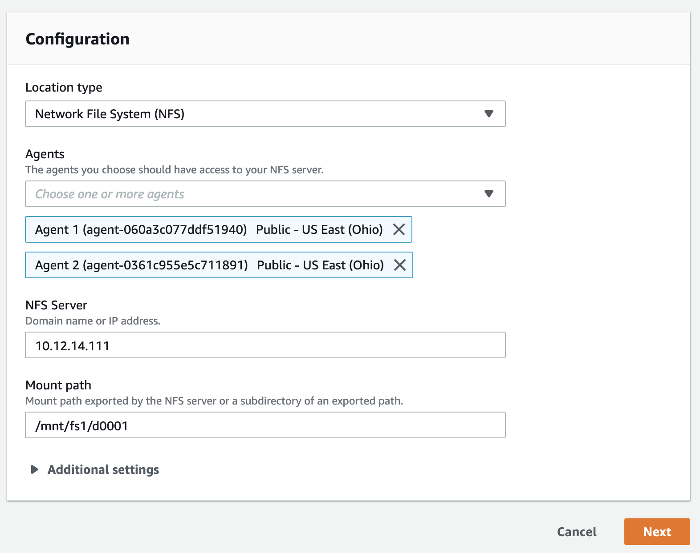
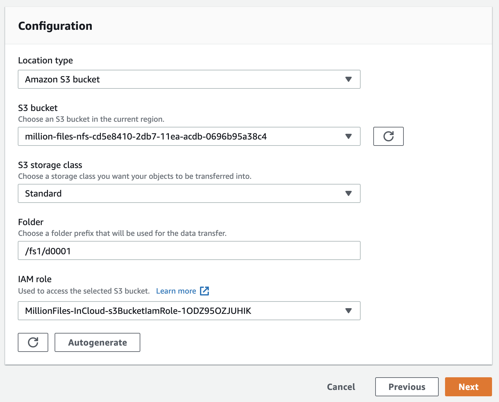
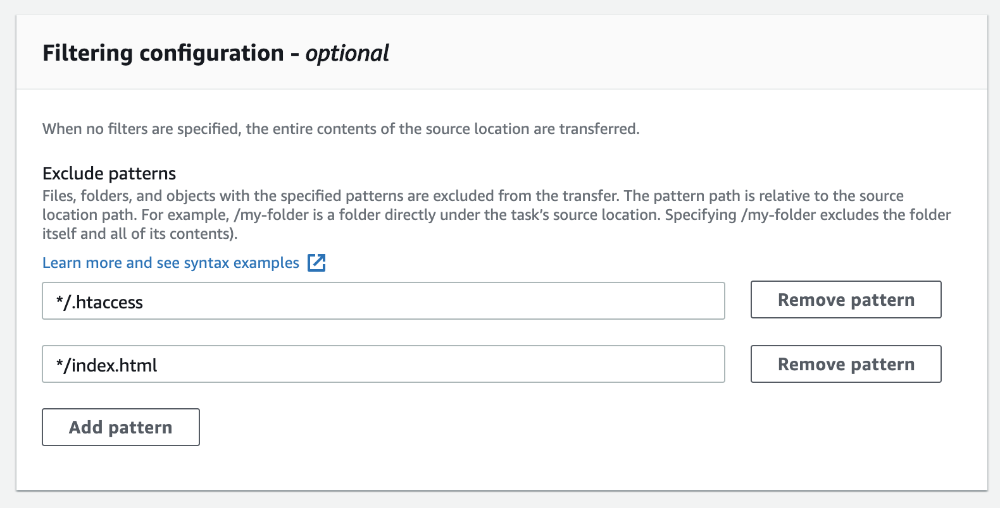
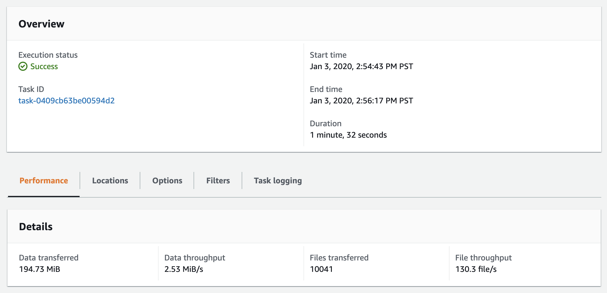
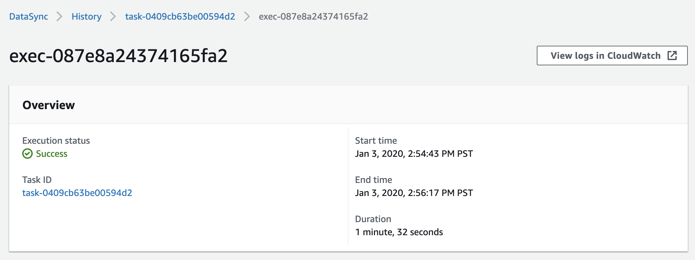

# **AWS DataSync**

### Migrate millions of files using AWS DataSync

© 2020 Amazon Web Services, Inc. and its affiliates. All rights reserved.
This sample code is made available under the MIT-0 license. See the LICENSE file.

Errors or corrections? Contact [jeffbart@amazon.com](mailto:jeffbart@amazon.com).

---

# Module 4
## Run a test transfer to validate network and performance

Before performing a full transfer of your data, it's always a good idea to do a test run to validate assumptions about performance and to verify DataSync settings.  A test run will also validate proper network connectivity, ensuring your DataSync agent(s) can communicate properly with the DataSync service in the cloud.

In this module, you will run a simple task to copy a portion of the data from the **fs1** file system to the S3 bucket.  You will use both agents to validate network connectivity and functionality and you will use exclude filters to avoid copying the .htaccess and index.html files in each directory.  Once the task has completed the transfer, you will use various tools to explore the task results.

## Module Steps

#### 1. Create a new DataSync task

1. Go to the DataSync console in the **IN-CLOUD** region, click Tasks on the left side of the page and then click the **Create task** button.
2. You will be prompted to create a source location, which in this particular case, will be the **fs1** file system on your NFS server.  Make sure **Create a new location** is selected and for _Location type_ select **Network File System (NFS)** from the drop-down.
3. You will use both agents for this task, so select **Agent 1** from the drop-down, then select **Agent 2**.  Both agents should be listed as selected.
4. Enter the **Private IP address** of the NFS server, per the CloudFormation outputs in the **ON-PREMISES** region. This is the IP address that the DataSync agent will use to mount the NFS server.
5. Under _Mount path_, enter **/mnt/fs1/d0001**.  This will copy files only from the 'd0001' directory on fs1.

  

6. Click **Next**.
7. Now you will create the destination location, which is the S3 bucket. Make sure **Create a new location** is selected and for _Location type_ select **Amazon S3 bucket** from the drop-down.
8. From the _S3 bucket_ drop-down, select the bucket that was created as part of the CloudFormation stack in the **IN-CLOUD** region.  The bucket name is prefixed with _million_files_nfs_.
9. For _S3 storage class_, select **Standard**.
10. Under _Folder_, enter **/fs1/d0001**.  This will put all of the files transferred into this folder on the bucket and provides a place for future files to be copied.
11. Under _IAM role_, select the S3 bucket IAM role that starts with **MillionFiles-inCloud**.  The full name of the role can be found in the outputs for the CloudFormation stack from the IN-CLOUD region.  This role gives the DataSync service the rights necessary to write data to the S3 bucket.  We could have also allowed the DataSync service to Autogenerate a role for us.

  

12. Click **Next**.

13. Scroll up and name the task **Test Task**.
14. In the _Options_ section, under _Verify data_, select **Verify only the data transferred**.  This will verify that every byte of every file transferred is written successfully to the destination.
15. Keep all other task options as-is.
16. Under the _Filtering configuration_ section, for _Exclude patterns_, enter **\*/.htaccess**.  Click the _Add Pattern_ button and enter **\*/index.html**.  This will prevent the task from copying these two files from any directory on the source file system.

  

17. Scroll down to the _Task logging_ section and select the **DataSyncLogs-MillionFiles-InCloud** log group from the drop-down.
9. Click **Next** and verify all task settings are correct.
10. Click **Create task**.

#### 2. Run the task

1. Wait for the **Task status** to transition from "Creating" to "Available".
2. To run the task, click the **Start** button, verify the settings one more time, and then click **Start**.
3. The task will immediately go into the &quot;Running&quot; state.
4. Under the **History** tab, click on the task execution object in the list.
5. As the task runs, the execution status will progress from &quot;Launching&quot; to &quot;Preparing&quot; to &quot;Transferring&quot; to &quot;Verifying&quot; and finally to &quot;Success&quot;.  The task execution will report statistics on the job, as shown below.  It will take a few minutes for the task to complete.  Once the task has finished, notice that **10,041** files were transferred.  This includes the 20 sub-folders under d0001, containing 500 files each, plus the manifest.lst file in each sub-folder, along with an object in S3 for the folders themselves, including the d0001 folder itself.

  

## Validation Step

From the AWS management console, select **Services** then **S3.**  In the bucket list, click on the bucket starting with **million-files-nfs**.  You should see a top-level folder **fs1**, inside of which is a folder **d0001**. Inside this folder will be the 20 sub-folders containing the files that were copied, including the manifest.lst file for each sub-folder.  Verify that the .htaccess and index.html files were _not_ copied.

  

To get more information on the results of the task execution, run the following commands, replacing the **execution ID** with the execution ID at the top of the DataSync console page (as shown above).  Also, replace the **--region** parameter with your IN-CLOUD region:

Use the "list-task-executions" command to get the full ARN of the task execution, which is then passed to the "describe-task-executions" command.

    ~$ aws datasync list-task-executions --region us-east-2 | grep exec-087e8a24374165fa2
        "TaskExecutionArn": "arn:aws:datasync:us-east-2:--:task/task-0409cb63be00594d2/execution/exec-087e8a24374165fa2",

    ~$ aws datasync describe-task-execution --region us-east-2 --task-execution-arn arn:aws:datasync:us-east-2:--:task/task-0409cb63be00594d2/execution/exec-087e8a24374165fa2

The output from the "describe-task-executions" command is shown below:

    {
        "TaskExecutionArn": "arn:aws:datasync:us-east-2:--:task/task-0409cb63be00594d2/execution/exec-087e8a24374165fa2",
        "Status": "SUCCESS",
        "Options": {
            "VerifyMode": "ONLY_FILES_TRANSFERRED",
            "OverwriteMode": "ALWAYS",
            "Atime": "BEST_EFFORT",
            "Mtime": "PRESERVE",
            "Uid": "INT_VALUE",
            "Gid": "INT_VALUE",
            "PreserveDeletedFiles": "PRESERVE",
            "PreserveDevices": "NONE",
            "PosixPermissions": "PRESERVE",
            "BytesPerSecond": -1,
            "TaskQueueing": "ENABLED"
        },
        "Excludes": [
            {
                "FilterType": "SIMPLE_PATTERN",
                "Value": "*/.htaccess|*/index.html"
            }
        ],
        "Includes": [],
        "StartTime": 1578092083.501,
        "EstimatedFilesToTransfer": 10041,
        "EstimatedBytesToTransfer": 204188279,
        "FilesTransferred": 10041,
        "BytesWritten": 204188279,
        "BytesTransferred": 204188279,
        "Result": {
            "PrepareDuration": 3447,
            "PrepareStatus": "SUCCESS",
            "TotalDuration": 91639,
            "TransferDuration": 77060,
            "TransferStatus": "SUCCESS",
            "VerifyDuration": 13459,
            "VerifyStatus": "SUCCESS"
        }
    }

The key takeaway from the command output is the time the task spent in the prepare, transfer and verify stages (PrepareDuration, TransferDuration, and VerifyDuration, respectively).  The numbers are in milliseconds, so you can see from the above output that the task spent **3.4** seconds in the prepare phse, **77** seconds in the transfer phase, and **13.4** seconds in the verify phase.

## Module Summary

In this module you successfully created a task to copy some of the files from fs1 on the on-premises NFS server into the S3 bucket.  You then verified that the expected files were copied successfully.  Because the command executed successfully, you have verified that both agents can communicate properly with the AWS DataSync service and you have verified that the exclude filter settings are configured properly.

In the next module, you will create three tasks to copy files from the three file systems: fs1, fs2, and fs3.  You will then execute the task and verify it executed successfully.

Go to [Module 5](/workshops/nfs-million-files/module5).
