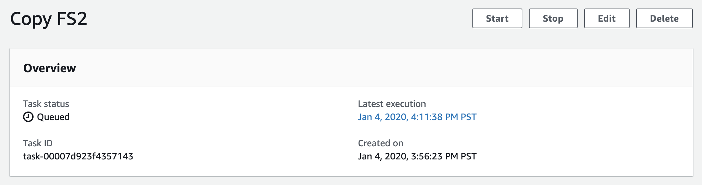

# **AWS DataSync**

### Migrate millions of files using AWS DataSync

© 2020 Amazon Web Services, Inc. and its affiliates. All rights reserved.
This sample code is made available under the MIT-0 license. See the LICENSE file.

Errors or corrections? Contact [jeffbart@amazon.com](mailto:jeffbart@amazon.com).

---

# Module 5
## Run the full transfer

In the previous module, you created and ran a simple task to copy a portion of the files from fs1 to the S3 bucket.  You did this to validate network connectivity of both agents and to verify that the exclude filters were configured properly.  You are now ready to run the full transfer.

In this module, you will create three DataSync tasks - one per file system on the NFS server.  Because you only have two agents, you will copy the smaller file systems (fs1 and fs2) using one agent, and the other agent will be used to copy the larger file system (fs3).  The task for fs2 will be queued while the task for fs1 executes.  When the task for fs1 completes, the queued task will be executed automatically.

## Module Steps

#### 1. Create the task for fs1

1. Go to the DataSync console in the **IN-CLOUD** region, click Tasks on the left side of the page and then click the **Create task** button.
2. Use the following settings for the source location:
   - Location type:  **Network File System (NFS)**
   - Agents: use **Agent 1** only
   - NFS Server: use the **Private IP address** of the NFS server
   - Mount path: **/mnt/fs1**
3. Click **Next**.
4. Use the following settings for the destination location:
   - Location type:  **Amazon S3 bucket**
   - S3 bucket: use the bucket name prefixed with **millions_files_nfs**
   - S3 storage class: **Standard**
   - Folder: **/fs1**
   - IAM role: select the S3 bucket IAM role that starts with **MillionFiles-inCloud**
5. Click **Next**.
6. Name the task **Copy FS1**.
7. Set the _Verify data_ option to **Verify only the data transferred**.
8. Configure the exclude patterns the same way you did for the test task.
9. For _Task logging_, select the **DataSyncLogs-MillionFiles-InCloud** log group from the drop-down.
10. Click **Next** and verify all task settings are correct.
11. Click **Create task**.

#### 2. Create the task for fs2

1. Select Tasks and then click the **Create task** button.
2. Use the following settings for the source location:
   - Location type:  **Network File System (NFS)**
   - Agents: use **Agent 1** only
   - NFS Server: use the **Private IP address** of the NFS server
   - Mount path: **/mnt/fs2**
3. Click **Next**.
4. Use the following settings for the destination location:
   - Location type:  **Amazon S3 bucket**
   - S3 bucket: use the bucket name is prefixed with **millions_files_nfs**
   - S3 storage class: **Standard**
   - Folder: **/fs2**
   - IAM role: select the S3 bucket IAM role that starts with **MillionFiles-inCloud**
5. Click **Next**.
6. Name the task **Copy FS2**.
7. Set the _Verify data_ option to **Verify only the data transferred**.
8. Make sure _Queueing_ is set to **Enabled**.
8. Configure the exclude patterns the same way you did for the test task.
17. For _Task logging_, select the **DataSyncLogs-MillionFiles-InCloud** log group from the drop-down.
9. Click **Next** and verify all task settings are correct.
10. Click **Create task**.

#### 3. Create the task for fs3

1. Select Tasks and then click the **Create task** button.
2. Use the following settings for the source location:
   - Location type:  **Network File System (NFS)**
   - Agents: use **Agent 2** only
   - NFS Server: use the **Private IP address** of the NFS server
   - Mount path: **/mnt/fs3**
3. Click **Next**.
4. Use the following settings for the destination location:
   - Location type:  **Amazon S3 bucket**
   - S3 bucket: use the bucket name is prefixed with **millions_files_nfs**
   - S3 storage class: **Standard**
   - Folder: **/fs3**
   - IAM role: select the S3 bucket IAM role that starts with **MillionFiles-inCloud**
5. Click **Next**.
6. Name the task **Copy FS3**.
7. Set the _Verify data_ option to **Verify only the data transferred**.
8. Configure the exclude patterns the same way you did for the test task.
17. For _Task logging_, select the **DataSyncLogs-MillionFiles-InCloud** log group from the drop-down.
9. Click **Next** and verify all task settings are correct.
10. Click **Create task**.

You should now have four tasks total - the test task from the previous module and the three tasks you just created.

#### 4. Start the tasks

1. Wait for the three tasks to transition from "Creating" to "Available".
2. Start the task for **fs1** first, followed by the task for **fs2**, and finally the task for **fs3**.
3. Notice that the task for **fs2** goes immediately to a _Queued_ status.  This is because the tasks for fs1 and fs2 use the same agent (Agent 1) and a DataSync agent can only execute one task at a time.

  

  Once the task for fs1 completes, the task for fs2 will be run automatically.

#### 5. Monitor your tasks

In a production environment, it's important to monitor all resources to be sure that DataSync transfers proceed as expected.  This includes monitoring not only the DataSync tasks themslves, but the NFS server and network as well.  Poor performance on the source storage, or network issues such as dropped packets or TCP retransmits can significantly degrade DataSync performance.

While the three tasks execute, use CloudWatch to explore the various metrics available for both agents and tasks.

It will take approximately 20 minutes for all tasks to complete.

## Validation Step

Once all tasks have executed successfully, check the S3 bucket.  You should now see three top-level folders: fs1, fs2, and fs3 (you may need to refresh the bucket).

Compare the results of the task execution for fs1 with fs2.  For the fs1 task, you should see **492,010** files transferred, while for the fs2 task, you should see **502,051** files transferred.  Both file systems have the same number of files, so why the discrepency?

Remember that when you ran the test task in module 4, you copied one top-level directory from fs1 - **10,041** files and directories total.  Because those files had already been copied once, DataSync knew they did not have to be copied again and they were skipped during the task for fs1.  DataSync made this determination during the Prepare phase of the task, when it compared files in the source to files in the destination and found some files already in the bucket.

In total, across the four tasks, you transferred _and verified_ **2,008,203** files in about 25 minutes.

## Module Summary

In this module you successfully created three tasks to copy files from the three file systems into the S3 bucket.  You distrubuted your tasks across multiple agents and you saw how multiple tasks can be queued and executed automatically on a single agent.

In the next module, you will perform two more transfers, diving deeper into how DataSync handles incremental transfers of data.

Go to [Module 6](/workshops/nfs-million-files/module6).
