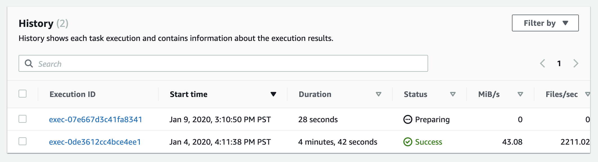
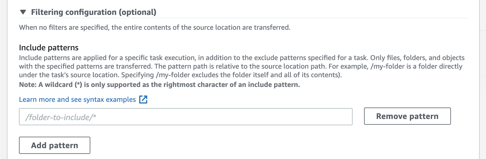
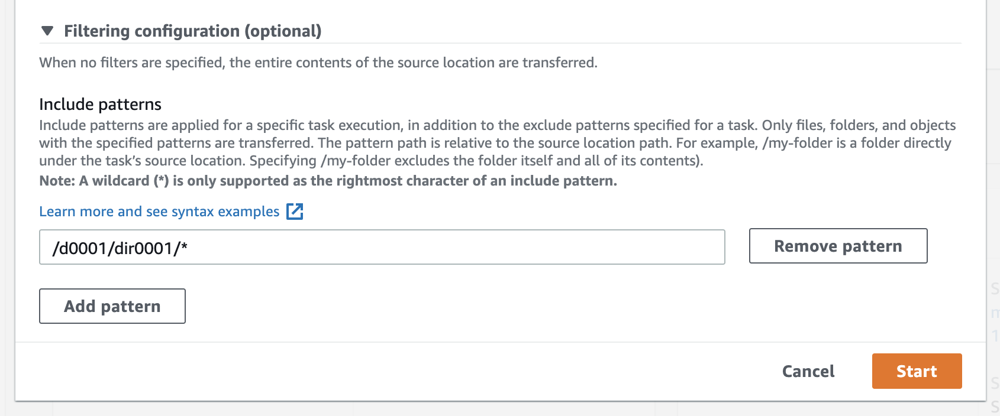

# **AWS DataSync**

### Migrate millions of files using AWS DataSync

© 2020 Amazon Web Services, Inc. and its affiliates. All rights reserved.
This sample code is made available under the MIT-0 license. See the LICENSE file.

Errors or corrections? Contact [jeffbart@amazon.com](mailto:jeffbart@amazon.com).

---

# Module 6
## Perform incremental copies of data

In the previous module, you copied 2+ million files from your on-premises NFS server to your S3 bucket.

In many cases, data transfers occur on file systems that are actively in production.  Files may continue to be added and modified, even after the initial transfer has been completed.  DataSync supports incremental transfers to make sure the destination location is in sync with the source.

In this module you will perform two additional task executions to demonstrate how DataSync handles incremental transfers of data.

## Module Steps

#### 1. Modify files on fs2

From your SSH console to the NFS server, run the following command to list the three file systems:

    [ec2-user@ ~]$ cd /mnt/fs2/d0001/dir0001
    [ec2-user@ ~]$ dd if=/dev/urandom of=newfile1 bs=1M count=1
    [ec2-user@ ~]$ echo "newfile1" >> manifest.lst

The above commands will create a new file on **fs2** named "newfile1" and append an entry for the new file to the end of the manifest.lst file in the local directory.  This means you now have one new file on fs2 and one file that has been modified.

#### 2. Re-run the FS2 task to get the changes

To update your S3 bucket with the changes you made to fs2, you only need to simply re-run the task named **Copy FS2** that you created in the previous module.  The source and destination locations are the same and you will keep the same task settings as you used previously.

1. Go to the DataSync console in the **IN-CLOUD** region, click Tasks on the left side of the page and then select the existing task with the name **Copy FS2**.
2. Click the **Start** button to launch a new execution of the task.
3. Verify the task settings, and then click **Start**.
4. Click on the **History** tab - you should now see two task executions, one for the task executed in the previous module and the task you just launched:

    

5. Select the newest task execution from the list to monitor its progress.
6. When the task completes, you should see that **3 files were transferred** and that the total data transferred was **1 MiB**.  The three files are the new file create above (which was 1 MiB in size), the manifest.lst file that was nmodified, and then the object in the S3 bucket representing the dir0001 folder, which needed to be updated because a new file was added.
7. Go to your S3 bucket and verify that you see the new file along with an updated timestamp on the manifest.lst file.

#### 3. Compare execution times

Although this task executed faster than the previous run, you may have noticed that the task spent a few minutes in the Preparing phase.  Run the following command to get the time spent preparing:

    ~$ aws datasync list-task-executions --region us-east-2 | grep exec-07e667d3c41fa8341
        "TaskExecutionArn": "arn:aws:datasync:us-east-2:--:task/task-00007d923f4357143/execution/exec-07e667d3c41fa8341",

    ~$ aws datasync describe-task-execution --region us-east-2 --task-execution-arn arn:aws:datasync:us-east-2:--:task/task-00007d923f4357143/execution/exec-07e667d3c41fa8341
    {
        "TaskExecutionArn": "arn:aws:datasync:us-east-2:--:task/task-00007d923f4357143/execution/exec-07e667d3c41fa8341",
        "Status": "SUCCESS",
        "Options": {
            "VerifyMode": "ONLY_FILES_TRANSFERRED",
            "OverwriteMode": "ALWAYS",
            "Atime": "BEST_EFFORT",
            "Mtime": "PRESERVE",
            "Uid": "INT_VALUE",
            "Gid": "INT_VALUE",
            "PreserveDeletedFiles": "PRESERVE",
            "PreserveDevices": "NONE",
            "PosixPermissions": "PRESERVE",
            "BytesPerSecond": -1,
            "TaskQueueing": "ENABLED"
        },
        "Excludes": [
            {
                "FilterType": "SIMPLE_PATTERN",
                "Value": "*/.htaccess|*/index.html"
            }
        ],
        "Includes": [],
        "StartTime": 1578611450.582,
        "EstimatedFilesToTransfer": 3,
        "EstimatedBytesToTransfer": 1053085,
        "FilesTransferred": 3,
        "BytesWritten": 1053085,
        "BytesTransferred": 1053085,
        "Result": {
            "PrepareDuration": 126943,
            "PrepareStatus": "SUCCESS",
            "TotalDuration": 199632,
            "TransferDuration": 71423,
            "TransferStatus": "SUCCESS",
            "VerifyDuration": 2467,
            "VerifyStatus": "SUCCESS"
        }
    }

Replace the region and execution IDs with the appropriate values.

In the above, you can see that the task spent about **127 seconds** in the prepare phase.  Repeat the above commands but use the ID for the previous task execution.  How much time did your first task for **fs2** spend in the prepare phase?

You will likely see a significant difference in times spent in the prepare phase.  While the first execution spent only a few seconds preparing, the second execution spent several minutes.  Why the difference?

When you executed the task to copy **fs2** for the first time, there were no objects in the S3 bucket under the /fs2 folder, so there was nothing to compare between the source and the destination.  However, with the second execution, there were now 500,000+ objects in the S3 bucket for **fs2** that needed to be compared with the source.  Comparing all of those files can take a while - in this case, several minutes.

Is there a way to reduce this time?

#### 3. One more incremental run

One way to reduce the amount of time required for preparing files is to limit the scope of the files to be compared.  You could do this by creating a new task with a more precise source location, but that would mean copying all of your settings to a new task, and risk missing a configuration setting.  Another option is to use task-level include filters.

Before doing another run, let's create more changes on in the dir0001 directory fs2.  Run the following commands:

    [ec2-user@ ~]$ cd /mnt/fs2/d0001/dir0001
    [ec2-user@ ~]$ dd if=/dev/urandom of=newfile2 bs=1M count=1
    [ec2-user@ ~]$ echo "newfile2" >> manifest.lst

Now re-run the same task again.  However, when prompted for task settings, scroll to the bottom of the dialog box and expand the section that says **Filtering configuration (optional)**.

Here you have the option to provide one or more **include** patterns, similar to the patterns you specified previously to exclude the .htaccess and index.html files.  But in this case, you are telling the DataSync task which files and folders to explicitly include, ignoring everything else.

In the edit box, enter the pattern **/d0001/dir0001/\*** and then click the **Start** button.

Remember that all filters (include and exclude) are relative to the path in the source location, which in this case is **/mnt/fs2/**.

## Validation Step

Once the task completes execution, go back to your S3 bucket and verify you see the latest new file, **newfile2**, as well as an updated timestamp for the manifest.lst file.

Run the **describe-task-execution** command again, with the latest task execution id, to get the duration for the prepare phase.  How does this compare to the previous execution?

You should see the prepare time has been reduced significantly.  This is because the DataSync task only scanned files in the /d0001/dir0001/ directory, which is only about 500 files.  Using include filters, you were able to significantly reduce the scope of the DataSync task, without have to use a new task.

## Module Summary

In this module, you re-ran the copy task for **fs2** to get incremental changes to the file system.  You saw how include filters can be used to limit the scope of an existing task and thus reduce overall processing times.

In the next module, you will go through the steps to clean up resources from this workshop.

Go to [Module 7](/workshops/nfs-million-files/module7).
