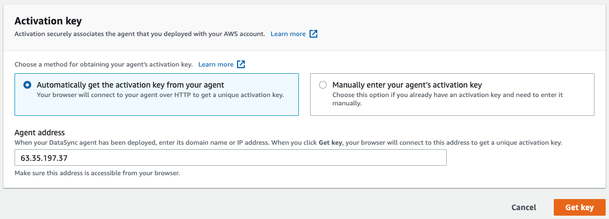
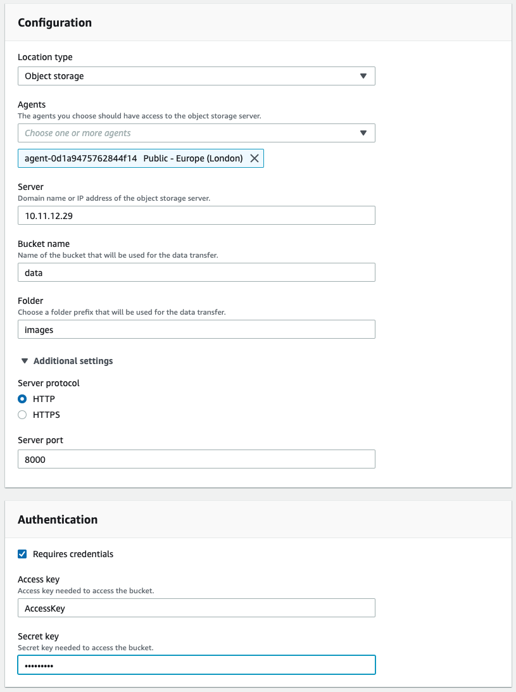
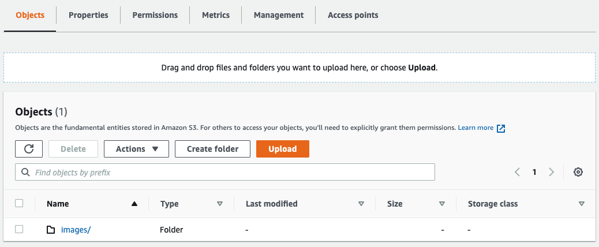

# **AWS DataSync**

### Object store migration using AWS DataSync from Scality to Amazon S3

© 2019 Amazon Web Services, Inc. and its affiliates. All rights reserved.
This sample code is made available under the MIT-0 license. See the LICENSE file.

Errors or corrections? Contact [owolabip@amazon.com](mailto:owolabip@amazon.com).

---

# Module 2
## Initial copy from Scality to S3 using DataSync

In this module, you will activate the DataSync agent deployed in the on-premises region, create DataSync locations, and then create a DataSync task to copy data from the source location to the destination location.

DataSync tasks perform the job of copying data and require two &quot;locations&quot; – a source and a destination.  With DataSync, a location is an endpoint where files/objects reside or will be copied to.  A location can be an NFS export, an SMB share, an object storage bucket, an Amazon S3 bucket, or an Amazon EFS file system.  Location objects are independent of tasks and a single location can be used with multiple tasks.

## Module Steps

#### 1. Activate the DataSync agent

Although the agent instance was created in the previous module, before it can be used it needs to be activated in the **in-cloud** region.  Follow the steps below to active the agent.

1. Go to the AWS Management console page in the **in-cloud** region and click  **Services**  then select  **DataSync.**
2. If no DataSync agents exist, click the **Get started** button, otherwise click the **Create agent** button.
3. The EC2 instance that will run the DataSync agent has already been deployed in the **on-premises** region.
4. Leave the Service endpoint as **"Public service endpoints"**.

5. Under the **Activation key** section, enter the **Public IP address** of the DataSync agent instance running in the on-premises region.  You can get this IP address from the CloudFormation outputs in the on-premises region.  You use the public IP address here because the agent needs to be accessible by your web browser for activation.  Enter the IP address of the agent as shown below, then click **Get key.**

  

6. Once the activation is successful, you will be shown the activation key and will be prompted for further information.

  

7. Enter an Agent name if desired, then click **Create agent**.

#### 2. Create object storage location

1. On the left-hand side of the DataSync service page, click on **Locations** and then click on **Create location**.

2. Create a location for the on-premises object storage bucket.  Select **Object storage** from the _Location type_ drop-down.
3. From the _Agents_ drop-down, select the DataSync agent that was created in the previous step.
4. For _Server_ enter the **Private IP address** of the object storage **S3Server**, per the CloudFormation outputs in the **on-premises** region.  This was the same IP address used to access the objects from the Application server, in the previous module.
5. Under _Bucket name_, enter &quot;data&quot;.
6. Under _Folder_, enter &quot;/&quot;. 
7. Expand _Additional settings_ and select &quot;HTTP&quot;. Under _Server port_ enter &quot;8000&quot;.
8. For _Access Key_ and _Secret key_ enter &quot;AccessKey&quot; and &quot;SecretKey&quot;.

  

9. Click **Create location**.

#### 3. Create S3 location

1. On the left-hand side of the DataSync service page, click on **Locations** and then click on **Create location**.

2. Create a location for the S3 bucket.  Select **Amazon S3 bucket** from the _Location type_ drop-down.
3. From the _S3 bucket_ drop-down, select the S3 bucket that starts with **data-migration-workshop** and is followed by a long GUID.
4. Keep the S3 storage class as **Standard**.
5. Under _Folder_, enter &quot;/&quot;. 
6. Under _IAM role_, select the S3 bucket IAM role that starts with **DataMigrationWorkshop-inCloud**.  The full name of the role can be found in the outputs for the in-cloud CloudFormation stack.

  

7. Click **Create location**.

On the left-side of the page, click **Locations** again.  You should now have two locations listed.  One for the object storage and one for the S3 bucket.

#### 4. Create a task

1. On the left-hand side of the DataSync service page, click on **Tasks** and then click on **Create task**.

2. Under _Source location options_, select **Choose an existing location**.
3. Under the _Existing locations_ drop-down, select the object storage location you created previously.
4. Click **Next.**

  

5. Under _Destination location options_, select **Choose an existing location**.
6. Under the _Existing locations_ drop-down, select the S3 bucket location you created previously.
7. Click **Next.**
8. Under the **Verify data** drop-down, select **Verify only the data transferred**. 
9. Under _Task Logging_ and _CloudWatch log group_ select **dmLogGroup** from the drop-down list. Keep all other options as-is and then click **Next.**
10. Click **Create task.**

#### 5. Run the task

1. Wait for the **Task status** to report &quot;Available&quot; (you may need to refresh the page).

  

2. To run the task, click the **Start** button, verify the settings, and then click **Start**.
3. The task will immediately go into the &quot;Running&quot; state.
4. Under the **History** tab, click on the task execution object in the list.

  

5. As the task runs, the execution status will progress from &quot;Launching&quot; to &quot;Preparing&quot; to &quot;Transferring&quot; to &quot;Verifying&quot; and finally to &quot;Success&quot;.  The task execution will report statistics on the job, as shown below.  It will take a few minutes for the task to complete.  Once the task has finished, notice that 200 files were transferred.  This is the 200 files in the data set along with the two folders in the path that we specified.

  

## Validation Step

From the in-cloud region management console, select **Services** then **S3.**  In the bucket list, click on the **data-migration-workshop** bucket.  You should see a top-level folder named &quot;images&quot;. Inside this folder should be the 200 .jpg files from the on-premises object storage.

## Module Summary

In this module you successfully activated the DataSync agent and created a task to copy files from the on-premises object storage into the AWS S3 bucket.  You then verified that the files were copied successfully.

In the next module, you will configure the in-cloud Application server to connect to the S3 bucket, providing access to the in-cloud object via S3.

Go to [Module 3](../module3/).
