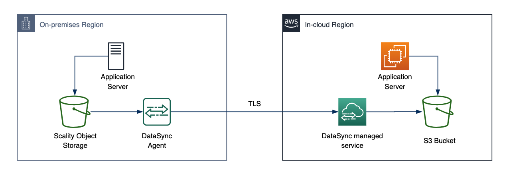

# **AWS DataSync**

### Object store migration using AWS DataSync from Scality to Amazon S3

© 2019 Amazon Web Services, Inc. and its affiliates. All rights reserved.
This sample code is made available under the MIT-0 license. See the LICENSE file.

Errors or corrections? Contact [owolabip@amazon.com](mailto:owolabip@amazon.com).

---

# Module 3
## Securely access data on in-cloud region S3 bucket

You now have the files from the object storage copied to your Amazon S3 bucket.  In this module, you will configure the Application server in the in-cloud region to connect to your S3 bucket and provide access to the objects in the bucket.



## Module Steps

#### 1. Verifying access to the Amazon S3 bucket

In AWS access to resources is administered by the Identity and Management service (IAM). By default, all S3 resources are private: only the resource owner can access them. S3 offers resource-based and user policies or a combination of them to manage permissions to your Amazon S3 resources. We will grant the required S3 access to our Application server in this section.

1. Go to the AWS Management console page in the **in-cloud** region and click  **Services**  then select  **EC2.**

2. If no gateways exist, click the **Get started** button, otherwise click the **Create gateway** button.
3. Select the **Instances** under the **Resources** section.
4. Select the **ApplicationServer** instnace from the list.
5. Connect to the Application server via SSH or with the Console, click on **Console** on the top right. Then click **Connect** to go to the CLI. If connecting with SSH use the key-pair provided to cloud formation and the Application servers public IP address.
6. From CLI for the Application server run the following command:

        $ aws s3 ls

  
 
7. This will fail and return: 

```An error occurred (AccessDenied) when calling the ListBuckets operation: Access Denied```

8. Go back to the **EC2** service and select the Application server. Under the details section go to **IAM Role** and click on the role &quot;_stack-name_-s3BucketIamRole-...&quot;
9. Under the **Permissions** tab, expand the _Policy_ and click on _{}JSON_ to view the policy document:

```{
    "Version": "2012-10-17",
    "Statement": [
        {
            "Action": [
                "s3:GetBucketLocation",
                "s3:ListBucket",
                "s3:ListBucketMultipartUploads",
                "s3:HeadBucket"
            ],
            "Resource": "arn:aws:s3:::data-migration-workshop-e5819550-1dd0-11eb-9c20-065bc1dc5e74",
            "Effect": "Allow"
        },
        {
            "Action": [
                "s3:AbortMultipartUpload",
                "s3:DeleteObject",
                "s3:GetObject",
                "s3:ListMultipartUploadParts",
                "s3:PutObject"
            ],
            "Resource": "arn:aws:s3:::data-migration-workshop-e5819550-1dd0-11eb-9c20-065bc1dc5e74/*",
            "Effect": "Allow"
        }
    ]
}
```
The policy limits access to only the &quot;data-migration-workshop&quot; bucket. This will give the application server just enough access to your S3 resources.

#### 2. Accessing the data in the Amazon S3 bucket

1. Connect to the Application server via SSH or with the Console, click on **Console** on the top right. 
2. From CLI for the Application server run the following command:

        $ aws s3 ls s3://data-migration-workshop-e5819550-1dd0-11eb-9c20-065bc1dc5e74/
        $ aws s3 ls s3://data-migration-workshop-e5819550-1dd0-11eb-9c20-065bc1dc5e74/images/

  

## Validation Step

Run the following command to verify that all the objects were transferred

    $ aws s3 ls s3://data-migration-workshop-e5819550-1dd0-11eb-9c20-065bc1dc5e74/images/ | wc -l

You should see the same number of object in the AWS S3 bucket.

## Module Summary

In this module you successfully verified the permission granted to the Application server and accessed the data migration S3 bucket.

Remember that our ultimate goal in this workshop is to shut off the on-premises Object storage and free up storage resources.  In a production environment, this would typically involve a &quot;cutover point&quot;, where there is momentary downtime to change over to the in-cloud Application server and the new storage, which in this workshop is the Amazon S3 bucket.  However, there are usually new object being created while a migration occurs, or shortly after, requiring another incremental transfer copy before cutover.

In the next module, you&#39;ll do one more incremental copy before the final cutover to the Amazon S3.

Go to [Module 4](../module4/).
