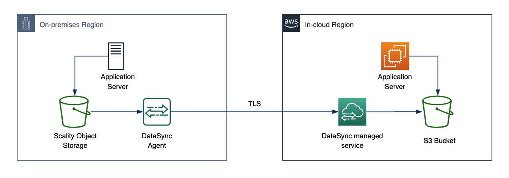
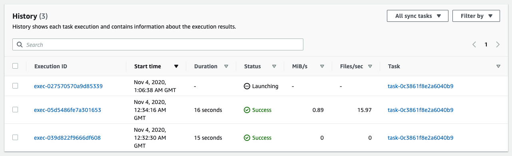
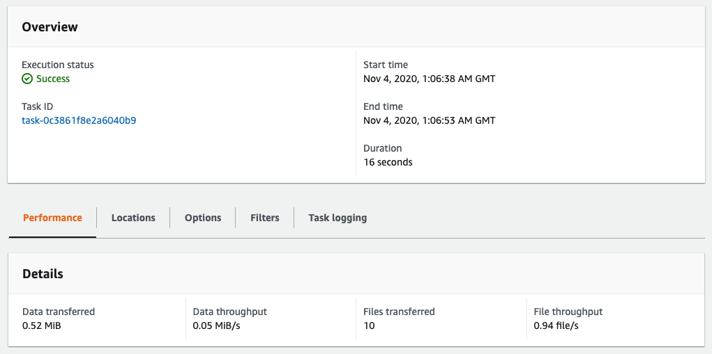
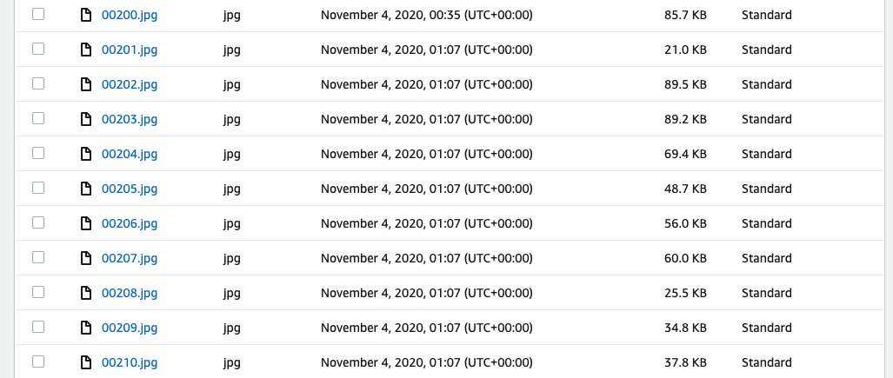

# **AWS DataSync**

### Object store migration using AWS DataSync from Scality to Amazon S3

© 2019 Amazon Web Services, Inc. and its affiliates. All rights reserved.
This sample code is made available under the MIT-0 license. See the LICENSE file.

Errors or corrections? Contact [owolabip@amazon.com](mailto:owolabip@amazon.com).

---

# Module 4
## One last incremental copy before cutover

In this module, you will perform an incremental data transfer using DataSync.  This will get any new objects that may have been created after the initial data copy.  Once you have verified all objects from the on-premises object storage have been copied, you can proceed to cutover.

## Module Steps

#### 1. Create some new file on the on-premises bucket

1. In the on-premises region, from the CLI for the **S3Server**, run the following command to create some new object in the Scality bucket:

        $ aws configure set aws_access_key_id AccessKey --profile scality
        $ aws configure set aws_secret_access_key SecretKey --profile scality
        $ for i in {00201..00210}; do aws s3 cp /media/data/images/$i.jpg s3://data/images/ --endpoint-url http://<S3ServerPrivateIP>:8000/ --profile scality; done

#### 2. Copy the new file to the S3 bucket

You have already created a DataSync task to copy files from the object store to the S3 bucket.  To copy the new file, you will just re-run the task.  DataSync will only copy files that have changed between the source and the destination.

1. Return to the in-cloud region AWS management console and go to the **DataSync** service.
2. Select the task created previously and click the **Start** button.
3. Use the default settings and then click **Start**.
4. Go to the History tab and select the newest task execution from the list.

  

It will take a few minutes for the task to complete.  When the task completes, take a look at the stats.  Although you ran the exact same task as last time, only 10 objects were copied.

If you take a look at the S3 bucket, you see that the new objects is there, just as expected:

## Module Summary

In this module you added some new objects to the object storage bucket prior to cutover.  You then ran the DataSync task a second time to pick up any object changes and copy them to S3.  Finally, you checked the S3 bucket to confirm that the new files were transfered.

With all of the data copied from the Scality object storage to S3, you are now ready to perform the cutover.

Go to [Module 5](../module5/).
