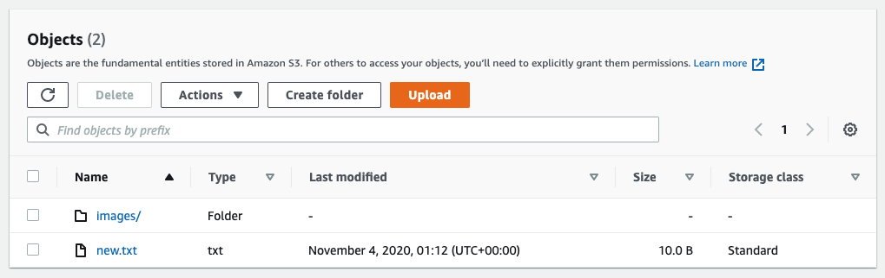

# **AWS DataSync**

### Object store migration using AWS DataSync from Scality to Amazon S3

© 2019 Amazon Web Services, Inc. and its affiliates. All rights reserved.
This sample code is made available under the MIT-0 license. See the LICENSE file.

Errors or corrections? Contact [owolabip@amazon.com](mailto:owolabip@amazon.com).

---

# Module 5
## Cutover to Amazon S3 and shutdown the Scality Object Storage

With all of the data in the S3 bucket, you are now ready to shut down your object storage and move exclusively to using S3.  In this module you will simply clean up your DataSync resources.  You will then write some test files from the in-cloud Application server to the S3 bucket.

## Module Steps

#### 1. Clean up DataSync resources

You&#39;re done with DataSync so you can go ahead and clean up resources.

1. Go to the **in-cloud** region AWS management console and go to the **DataSync** service.

2. Select **Tasks** and delete the task you created previously
3. Select **Locations** and delete the locations you created previously
4. Select **Agents** and delete the agent you activated previously.  Note that this **will not** delete the actual DataSync agent EC2 instance.  That will get deleted later, when the CloudFormation stack is deleted.

## Validation Step

From the CLI for the Application server, run the following command to create another new file in the S3 bucket:

        $ echo "test data" >> new.txt
        $ aws s3 cp new.txt s3://<bucketName>

Go back to the in-cloud region management console and go to **S3**.  Select the **data-migration-workshop** bucket.  You should see the new.txt file in the bucket.

Your Application server has completed cutover!  You can now read all of the objects that used to be on the on-premises object storage. 

## Workshop Cleanup

To make sure all resources are deleted after this workshop scenario make sure you execute the steps in the order outlined below (you do not need to wait for CloudFormation to finish deleting before moving to the next step):

1. Delete all objects in the **data-migration-workshop** S3 bucket in the in-cloud region.  The bucket must be empty before it can be deleted by CloudFormation in the next step.
6. Go to the CloudFormation page in the in-cloud region and delete the stack named &quot;DataMigrationWorkshop-inCloudResources&quot;
7. Go to the CloudFormation page in the on-premises region and delete the stack named &quot;DataMigrationWorkshop-onPremResources&quot;

To make sure that all CloudFormation templates have been deleted correctly, confirm that all EC2 instances created in this workshop in the on-premises region are in the **terminated** state.
